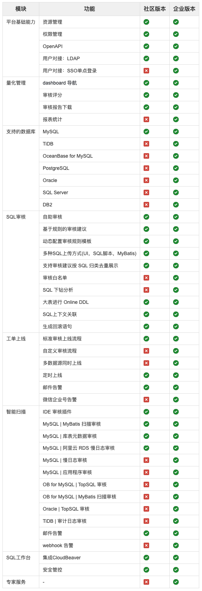

# 关于SQLE
SQLE 是由[上海爱可生信息技术股份有限公司](http://www.actionsky.com/) 开发并开源，支持SQL审核、索引优化、事前审核、事后审核、支持标准化上线流程、原生支持 MySQL 审核且数据库类型可扩展的 SQL 审核工具。 
## 产品特色
1. 支持通过插件的形式扩展可审核上线的数据库类型，无需升级软件，导入审核插件即可获对应数据库类型的审核上线能力，使用平台所有功能；
2. 支持标准的 HTTP API，可与其他内部流程系统对接；
3. 支持 DDL，和 DML 同时审核，并实现同工单内语句上下文关联；
4. 支持在审核规则外对语句做必要的对象验证，防止实际执行时库表不存在等情况。

## 主要功能
如何使用具体的功能可以参考第三章：[功能模块](../3.modules/overview.md)
### 功能列表
