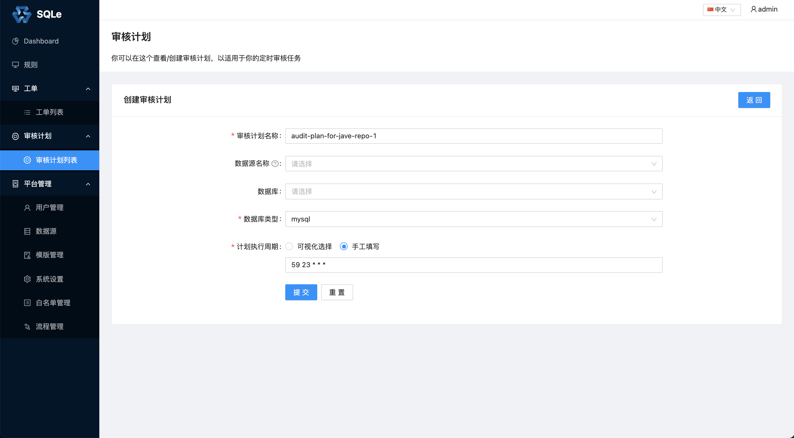
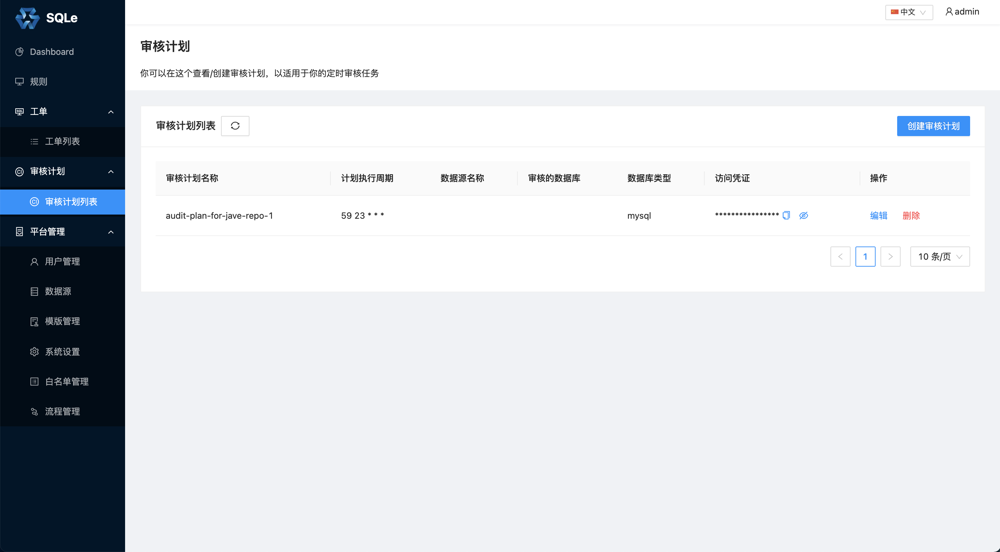
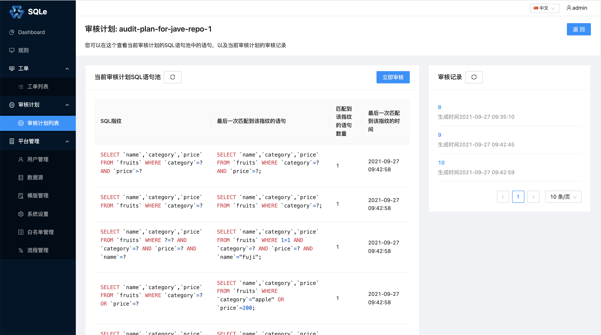

# 审核计划管理

## 使用

### 创建审核计划

创建审核计划，进行一些配置，包括：静态或者动态分析（配置**数据源名称**为动态分析，反之为静态分析）、定时 Cron和数据库类型等。

创建审核计划后，审核计划列表展示如下：

列表页面展示了当前 SQLE 中正在运行的所有审核计划。点击审核计划的**编辑**按钮修改这个审核计划。另外可以看到**访问凭证**一列，这是给 Scanner 使用的，使用方式请参考[Scanner](./scanner.md)一章。

### 审核计划详情
点击**审核计划**，进入审核计划的详情页面：

在**审核计划**的详情页面，我们可以看到它的 SQL 池列表和对应产生的审核报告列表。

上图中展示的 SQL 池列表中的 SQL 是通过 [MyBatis Scanner](TODO) 扫描代码仓库中文件得到的。**MyBatis Scanner** 会解析 XML 格式文件，将文件中解析出的 SQL 上传至相应的**审核计划**。