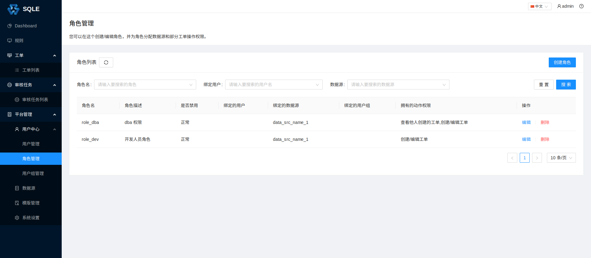

# 角色管理

## 创建角色

在左侧导航栏的「平台管理」中的「用户管理」页面中，点击「创建角色」，填写角色相关信息，如下图：

* 角色名；
* 角色描述（选填）：略；
* 数据源（选填）：如果当前还未添加数据源，可以在添加数据源后，通过「编辑」修改；
* 绑定用户（选填）：如果当前还未创建用户，可以在创建用户后，通过「编辑」修改；
* 绑定用户组（选填）：如果当前还未创建用户组，可以在创建用户组后，通过「编辑」修改；
* 动作权限(选填)：可以在创建时进行复选。或者在创建后，通过「编辑」修改。目前支持的动作权限有：

    - 查看他人工单（20100）：当角色拥有该动作权限时，角色可以查看绑定的数据源上其他用户创建的工单；
    - 创建/编辑工单（20200）：当角色拥有该动作权限时，角色可以在绑定的数据源上创建工单。

## 修改角色

    
点击角色的「编辑」按钮，如下图：

上诉操作将角色 DBA
下的用户数据源更新为`data_src_name_1`和`data_src_name_2`，并且绑定了用户组`dba_group`。

## 用户、用户组与角色

用户是否能够进行某种操作，受限于用户所关联的角色的权限。
当两个角色绑定的动作权限与数据源都相同时，可以认为这两个角色是「相同」或「相等」。
结合用户组管理来看，一个用户所**关联**的角色由两部分组成：

- 用户自身所**绑定**的角色；
- 用户所在的用户组所**绑定**的角色。

因此，一个用户的权限实际上是上述两组角色的并集。

当出现以下情况时，用户会失去一个角色的权限：

- 将用户与该角色解绑，且用户没有关联其他相同权限的角色；
- 将该角色禁用，且用户没有关联其他相同权限的角色；
- 将该角色所在的用户组禁用，且用户没有关联其他相同权限的角色；
- 将该角色移出用户组，且用户没有关联其他相同权限的角色。
