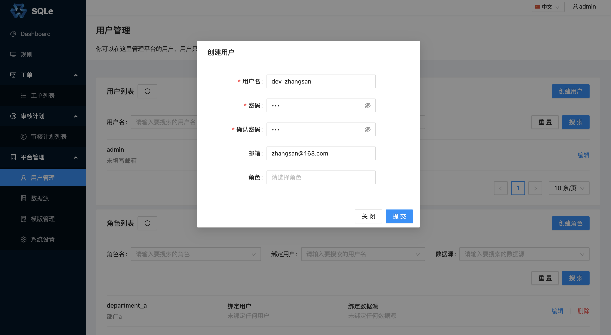

# 用户管理

SQLE 的用户通常包括以下 3 类：
* 数据库运维工程师（DBA）
* 研发工程师
* 项目管理员

**DBA** 是 SQLE 的管理人员，他们通常负责平台的搭建与日常管理；**研发工程师**使用自己的账户创建工单；**项目管理员**通常是工单审批流程（见[审核工单管理](../3.5_auditworkflow/auditworkflow_management.md)）中的一员。

## 创建用户
在左侧导航栏的「平台管理」中的「用户管理」页面中，点击「创建用户」，填写用户相关信息，如下图：

* 用户名
* 密码
* 确认密码
* 邮箱：填写邮箱后，将会以邮件形式通知工单流转状态。
* 角色：如果当前还未创建角色，可以在创建角色后，通过「编辑」修改

## 修改用户
点击用户的「编辑」按钮，如下图：

上诉操作将用户 dev_zhangsan 拥有的角色更新为 department_a。