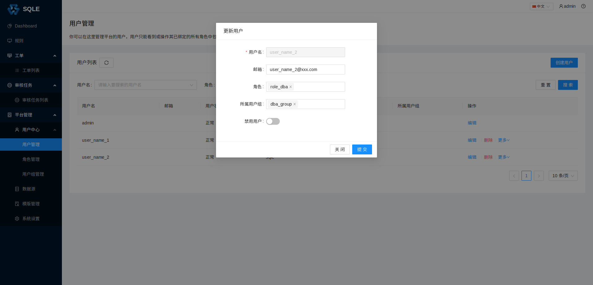
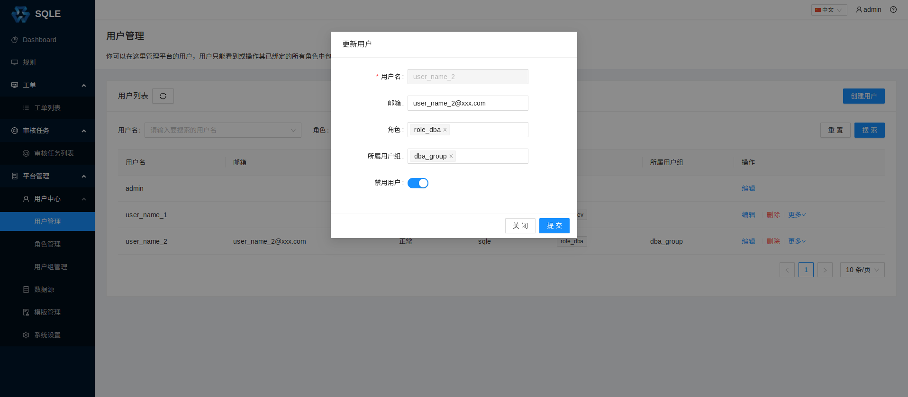
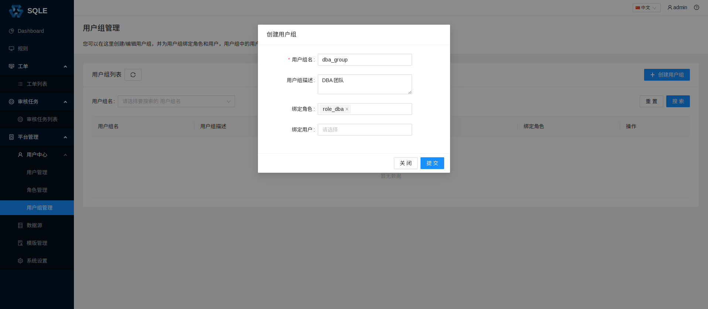

# 用户管理

SQLE 的用户通常包括以下 3 类：
* 数据库运维工程师（DBA）：SQLE 的管理人员，他们通常负责平台的搭建与日常管理；
* 研发工程师：通常使用自己的账户创建工单；
* 项目管理员：通常是工单审批流程（见[审核工单管理](../3.5_auditworkflow/auditworkflow_management.md)）中的一员。

## 创建用户
在左侧导航栏的「平台管理」-「用户中心」-「用户管理」页面中，点击「创建用户」，填写用户相关信息，如下图：

* 用户名；
* 密码；
* 确认密码；
* 邮箱：填写邮箱后，将会以邮件形式通知工单流转状态;
* 角色：如果当前还未创建角色，可以在创建角色后，通过「编辑」修改；
* 所属用户组：如果当前还未创建用户组，可以在创建用户组后，通过「编辑」修改。

## 修改用户
点击用户的「编辑」按钮，如下图：

上诉操作将用户 dba 的邮箱地址更新为`user_name_2@xxx.com`
，并且绑定了角色和用户组。

管理员还可以对指定的用户进行「禁用」或者「启用」。
当用户被管理员禁用后，该用户将无法登录，也无法进行任何操作。
管理员用户永远无法禁用自己本身。

## 用户组的管理

当管理员需要批量管理用户时，可以使用用户组来管理多个相同属性的用户。
比如依照「运维工程师」、「研发工程师」、「项目管理员」进行分别授权与管理。

需要注意的是：

- 用户会继承所在用户组所绑定的角色。
- 当一个用户组被禁用，用户不会被禁用，但会失去该用户组所绑定的角色。

