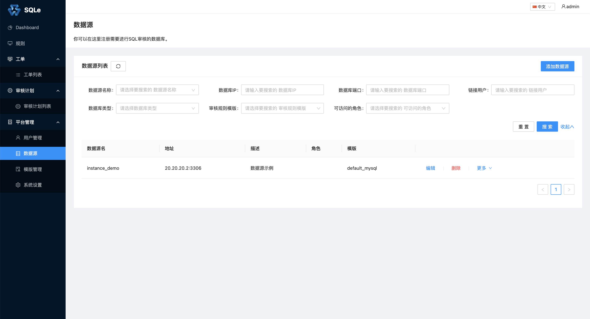

# 数据源管理

**数据源管理** 是 SQLE 提供的管理线上数据库的功能。一个数据源对应着一个数据库实例。在审核 SQL 时，如果指定了关联的数据源（动态审核），可以得到更加详细的审核结果。详情可参考[审核工单](../3.3_auditworkflow/overview.md)一章。

## 添加数据源

在左侧导航栏的「平台管理」中的「数据源」页面中，点击「添加数据源」，填写数据源相关信息，如下图：

* 数据源名称：略
* 数据源描述：略
* 数据库类型：社区版只支持添加 MySQL 数据库，详情见[审核插件](TODO)。
* 数据库IP：略
* 数据库端口：略
* 连接用户：略
* 密码：略
* 测试数据库连通性：填写完必要的信息后，点击此按钮可以测试 SQLE 是否能访问该数据库。
* 可访问角色（选填）：表示数据源可以被哪些角色访问。
* 审核规则模板（选填）：表示数据源有哪些审核规则。
* 应用的工作流（选填）：表示在数据源上创建的工单所应用的工作流。社区版只支持默认的工作流 default，详情见[工作流管理](../3.3_auditworkflow/workflow_management.md)。

点击「提交」后，回到数据源列表页面，即可看见刚才添加的数据源：

如果数据源数量过多，可以通过筛选功能快速的找到某类数据源。

## 修改数据源
点击**数据源列表**页面的「编辑」按钮，可以修改指定数据源。**修改数据源**中的可修改项与**添加数据源**一致，可参考上面的一节的说明。

## 删除数据源
点击**数据源列表**页面的「删除」按钮，可以删除指定数据源。