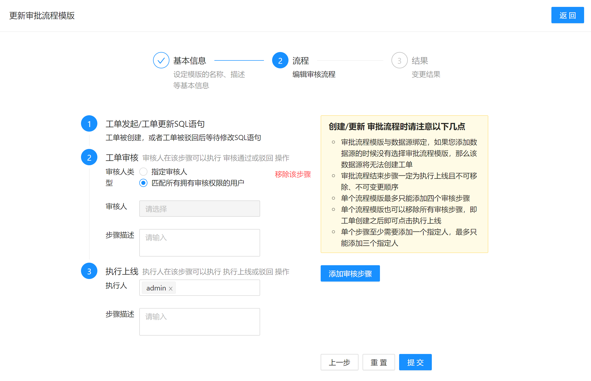

# 流程模板管理（企业版功能）

[工作流](https://en.wikipedia.org/wiki/Workflow)要解决的主要问题是：为实现某个业务目标，在多个参与者之间按某种预定规则自动传递文档、信息或者任务。

SQLE 使用工作流来解决 SQL 上线的流程化问题。在 SQLE 中称为流程模板。

## 创建流程模板

在左侧导航栏的「平台管理」中的「流程管理」页面中，点击「创建流程模板」，填写流程模板相关信息。

### 步骤 1：

在这一步中, 指定了流程的基本信息

* 新建的流程名称为 `workflow_template_a`, 这个名称在流程模板中是唯一的
* 审核流程模板的描述
* 应用这个流程的工单必须所有SQL都没有触发大于 `告警` 级别的规则才可以提交工单
* `asdf` `db2` 这两个数据源将会使用此审核流程

### 步骤 2：

在这一步中，添加了两个审核步骤：

* 工单创建后，流转到 DBA 初审
* DBA 初审后，流转到部门领导复审

最后，部门领导复审后，流转到 DBA 执行上线。

### 部分选项说明

* 工单审核步骤中如果审核人类型为 "匹配所有拥有审核权限的用户" , 则创建工单时所有拥有对应数据库工单审核权限的用户(组)都会被指定为此步审核者, 如果创建工单时没有任何用户拥有此数据源工单审核权限, 则工单审核者将会被指定为admin
* 当审核人类型为 "指定审核人" 时, 指定的审核人可以没有工单审核权限

## 默认审核模板

1. 工单发起
2. 由拥有审核权限的用户进行审核
3. 由admin执行上线

