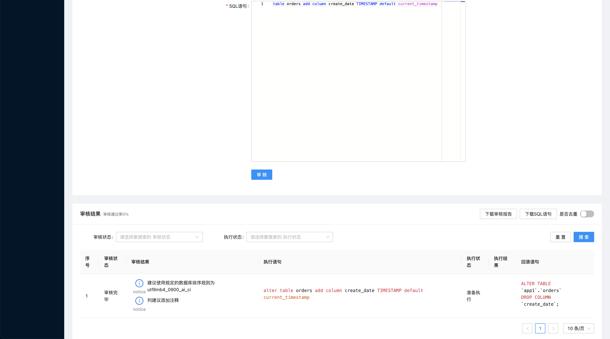
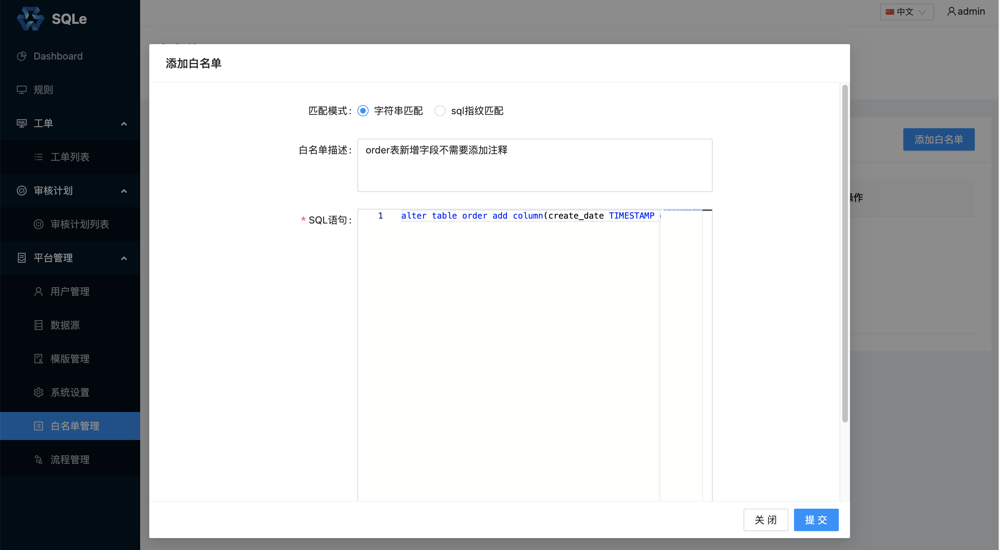
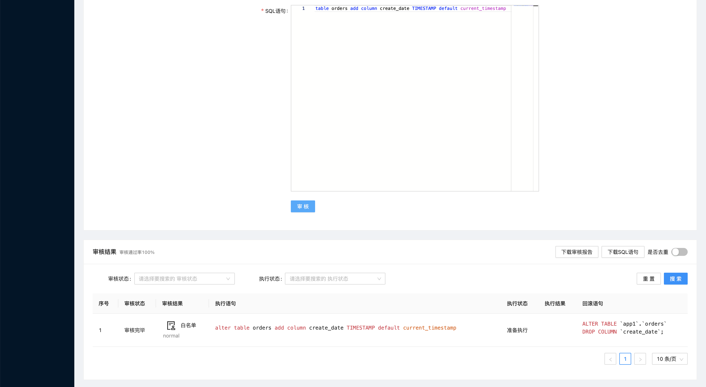

# 白名单管理（企业版功能）

当我们已知一些 SQL 存在不规范之处，但又想忽略时，可以使用 SQL 白名单功能。

## 添加白名单

### 字符串匹配
在左侧导航栏的「平台管理」中的「白名单管理」页面中，点击「添加白名单」，填写 SQL 白名单相关信息。

有一条 SQL：**alter table orders add column create_date TIMESTAMP default current_timestamp** 需要上线，在使用白名单前，提交审核：

审核通过率为 0% 无法上线。

假设因为某些原因无法修改 SQL，但是该 SQL 又必须上线。这时可以添加一条针对于该 SQL 的白名单：

再次提交审核：

审核通过率为 100% 可以提交工单上线。

### 指纹匹配
当我们想要忽略一类 SQL 时，又不想为每条 SQL 添加白名单时，可以在添加白名单时选择「sql指纹匹配」。