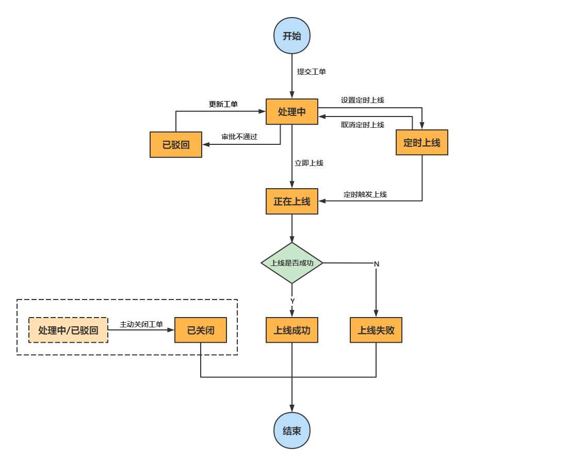
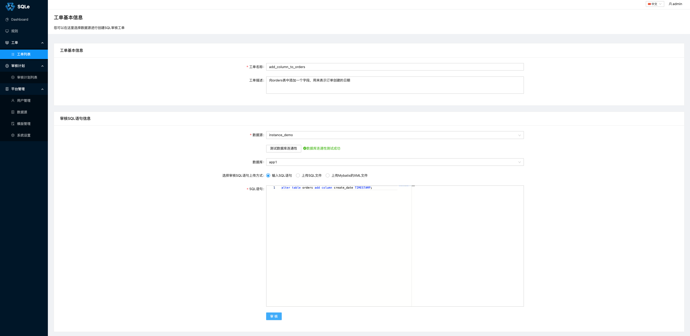
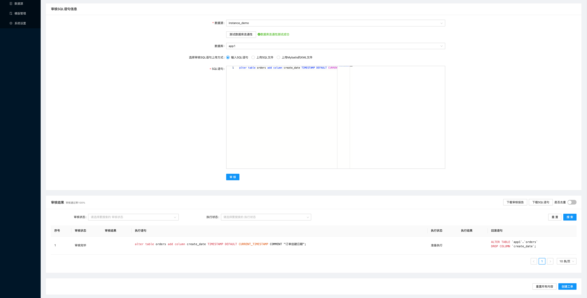
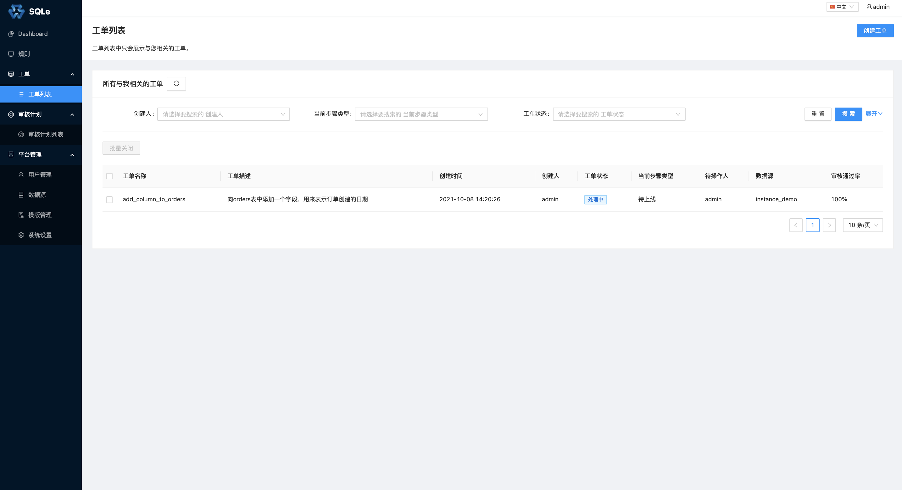

# 审核工单管理

在这一节中，会用一个具体的案例来逐一介绍「审核工单管理」中的各个功能模块。

## 工单状态
### 工单状态流转图

### 工单状态介绍
#### 处理中
创建完的工单自动进入`处理中`状态，处理中代表工单正在流程审批中或者还未上线。

#### 已驳回
1. `处理中`的工单可以由每级的审批人或者上线人进行驳回，驳回后工单进入`已驳回`状态；
2. 此状态的工单可以由创建人或者超管用户进行修改并重新提交工单。

#### 已关闭
1. `处理中`或`已驳回`的工单可以由创建人或者超管用户在任何时刻关闭工单，工单流转结束无法再操作；
2. 已经进入上线流程的工单无法关闭。

#### 定时上线
1. 审批通过的工单，会进入上线阶段，可以由上线人设置定时上线；
2. 已经设置定时上线的工单可以由上线人取消定时上线，此时工单回到`处理中`,可以再次进行驳回、定时上线、立即上线。

#### 正在上线
1. 当上线人进行立即上线，工单会短暂的进入`正在上线`阶段，该阶段的时间取决于SQL是否上线完毕；
2. 定时上线的工单到时间会自动进行SQL上线，此时工单也会进入`正在上线`阶段；
3. SQL上线阻塞的工单会一直处于`正在上线`状态。

#### 上线成功
SQL上线成功的工单会进入`上线成功`状态，工单流转结束无法再操作。

####上线失败
SQL上线失败的工单会进入`上线失败`状态，工单流转结束无法再操作。

## 创建审核工单

在左侧导航栏的「工单」中的「工单列表」页面中，点击「创建工单」，审核工单相关信息，如下图：

* 工单名称：该字段需要保证工单全局唯一性。
* 工单描述：略
* 数据源：表示修改最终会应用到哪个数据源。
* 数据库：表示 orders 表所在的 schema，相当于执行 use 语句。
* SQL 语句：填写需要上线的 SQL 语句，该语句会被审核。

在确认需要上线的 SQL 语句后，点击页面下方的「审核」按钮：

在**审核结果**列表中，可以看到被审核的 SQL 语句（**alter table orders add column create_date TIMESTAMP**）不符合该数据源上绑定的审核规则（或者说这条 SQL 触发了该数据源上的审核规则）。

按照**审核结果**给出的提示修改 SQL 语句，再次点击「审核」按钮：

可以看到，修改后的 SQL 已经完全符合规范，审核通过率也从 0% 变成了 100%。点击「创建工单」，回到工单列表，即可看到该工单显示为**处理中**：

