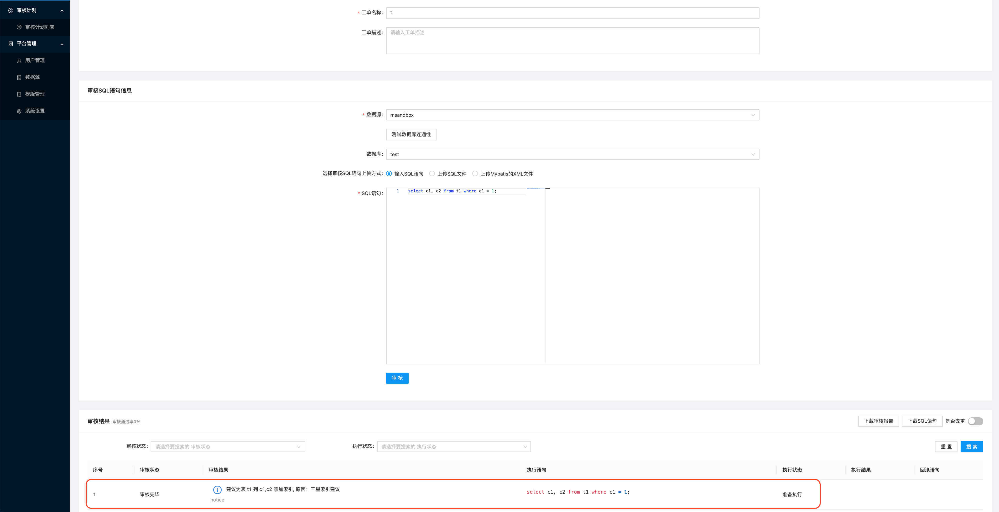
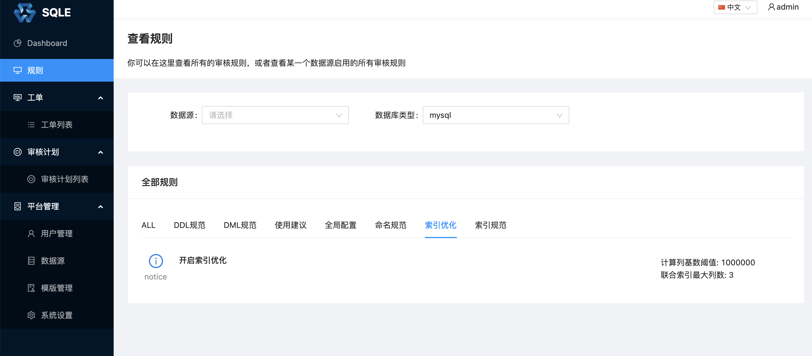
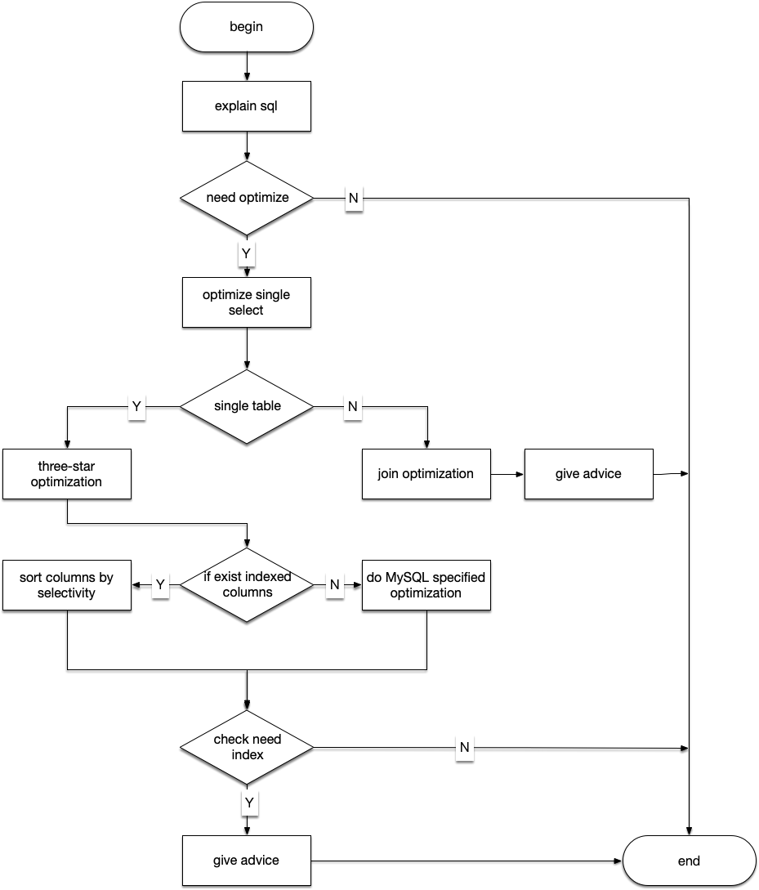

# 索引优化

## 一、背景
大多数生产环境上对数据库的操作都是读多写少。对数据库的查询操作经常容易造成应用的性能瓶颈。其中大概率原因是以下两个：
1. SQL 语句不合理，导致查询效率低下；
2. 数据库索引不合理，导致查询效率低下。

针对第二个问题，我们可以通过优化数据库索引来提高查询效率。在 SQLE 中提供了索引优化的功能。

## 二、使用方式
对 SQL 的索引优化结果通过 SQL 审核页面展示出来。如下图：

在 SQLE 中索引优化默认是关闭状态。通过配置规则开启索引优化：

这个规则上有以下参数可以配置：

### 参数 1：联合索引最大列数
SQLE 给出的索引建议可能是多列联合索引。当联合索引的列数太多，可能会增加数据库对索引的维护成本。所以通过一个配置来控制联合索引的最大列数，默认值是 3。

### 参数 2：计算列基数阈值
在建立联合索引时，字段的顺序非常重要。将基数较高的列放到前面，可以走索引的过程中筛选掉更多的不需要的记录。

但是完全按照基数顺序建立联合索引，在一些场景下可能也不那么完美：
1. 表的记录较多，计算基数对性能影响较大；
2. 表的数据分布可能经常发生变化，列的基数大小有可能因此发生变化。

所以 SQLE 给出了一个阈值参数，来控制联合索引是否按照基数从大到小的顺序建立，默认值是 1000000。

## 三、优化策略
整个索引优化的流程图如下：

下面简单介绍一下部分的流程模块里做的事情：

### 1. explain SQL
在索引优化的过程中，会借助 MySQL 的 EXPLAIN 命令，来查询 SQL 执行计划。通过执行计划，可以更准确的知道当前 SQL 的索引使用情况。

### 2. need optimize
无论多么复杂的查询，最终都会被解析成一个个单表查询。一个单表查询对应执行计划的一行记录。通过对每一行记录的分析，可以知道是否需要对表进行索引优化。

通过判断单表的访问方式，可以判断是否需要对表进行索引优化。单表的访问方式在执行计划记录中对应 `type` 列。`type` 的具体值就不一一介绍了，详情可以参考文档 [EXPLAIN Output Format](https://dev.mysql.com/doc/refman/5.7/en/explain-output.html#explain-join-types)。

SQLE 会对访问方式为 `ALL` 和 `index` 的表做索引优化。

### 3. optimize single select
对于复杂的如带有子查询的 SQL 语句，SQLE 会对每一个子查询进行索引优化。

### 4. three-star optimization/join optimization
对于多表的 select 语句，SQLE 会根据 explain 的结果，对被驱动表进行索引优化，优化方式是建议在被驱动表的关联字段上建立索引。

对于单表的 select 语句，SQLE 则参考「Relational database index design and the optimizers」一书中的三星索引算法，尽量给出三星索引建议。

### 5. if exist indexes columns
通过前面的步骤，如果给出了一个索引建议。例如建议 c1 上添加索引。这时还需要判断：
1. 数据库中是否存在该索引
2. 数据库中是否存在以 c1 为前缀的联合索引

如果满足上面两个条件之一，则放弃该索引建议。

