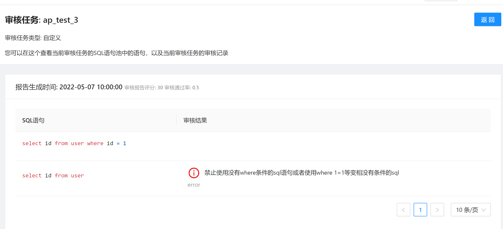

# 审核任务管理
## 创建审核任务

### 参数说明
* 审核任务名称：略；
* 数据源名称：填写需要审核的目标库，若不填则仅进行静态分析不会连库；
* 审核任务类型：参考[审核任务介绍](./introduction.md)的审核任务分类；
* 任务审核周期：配置的是SQLE对审核任务进行自动审核的周期。

### 特殊参数说明
不同的审核任务类型可能会配置不同的参数，选中对应的审核类型后会自动展示
#### 库表元数据
* 采集周期（分钟）：默认60分钟，代表SQLE server间隔多久采集一次库表元数据；
* 是否采集视图信息：开启后会采集视图。

#### Top SQL
* 采集周期（分钟）: 默认60分钟，代表SQLE server间隔多久采集一次Oracle Top SQL；
* top_n: 展示前多少条记录，默认3;
* V$SQLAREA中的排序字段：采用那个字段作为Top SQL 的排序字段
  * "executions"： 按总执行次数排序
  * "elapsed_time"：按总执行时间排序（默认值）
  * "cpu_time"：按CPU消耗时间排序
  * "disk_reads"：按物理读次数排序
  * "buffer_gets"：按逻辑读次数排序
  * "user_io_wait_time"：按 IO 等待时间排序

#### 慢日志
* 审核过去时间段内抓取的SQL（分钟）：表示触发审核时，以"最后一次匹配到该指纹的时间"为基准，向前推算一个时间段，只会审核这个时间段内抓取到的SQL。当设置为0时，表示没有时间段的限制，既审核SQL语句池里的所有SQL。默认为0。

## 审核任务列表

列表页面展示了当前 SQLE 中正在运行的所有审核任务。点击审核任务的**编辑**按钮修改这个审核任务。另外可以看到**访问凭证**一列，这是给 Scanner 使用的，使用方式请参考[Scanner](./scanner_management.md)一章。

## 审核任务详情
点击**审核任务**，进入审核任务的详情页面：

在**审核任务**的详情页面，我们可以看到它的 SQL 池列表和对应产生的审核报告列表。上图中展示的 SQL 池列表中的 SQL 是通过 [MyBatis Scanner](./scanner_management.md) 扫描代码仓库中文件得到的。

## 审核任务审核报告
点击**审核记录**，可以查看审核报告
