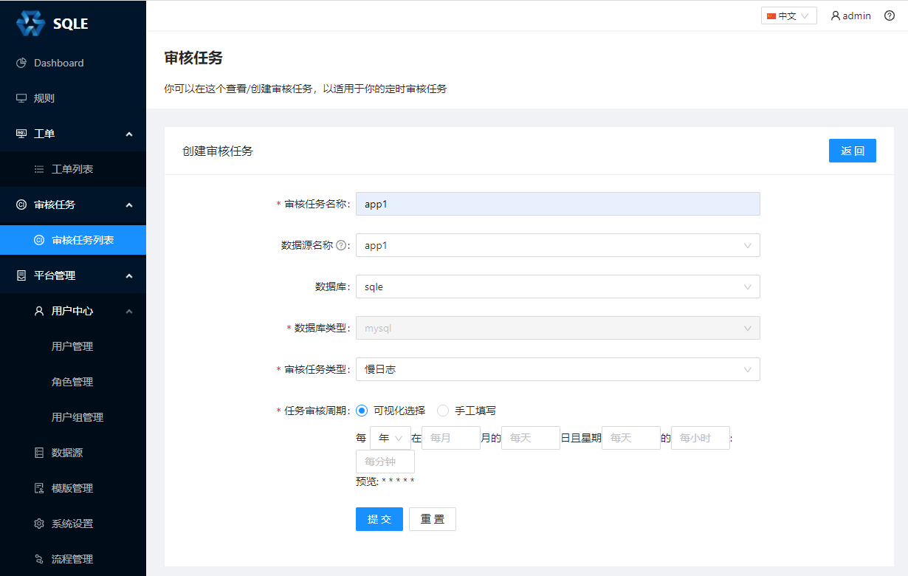
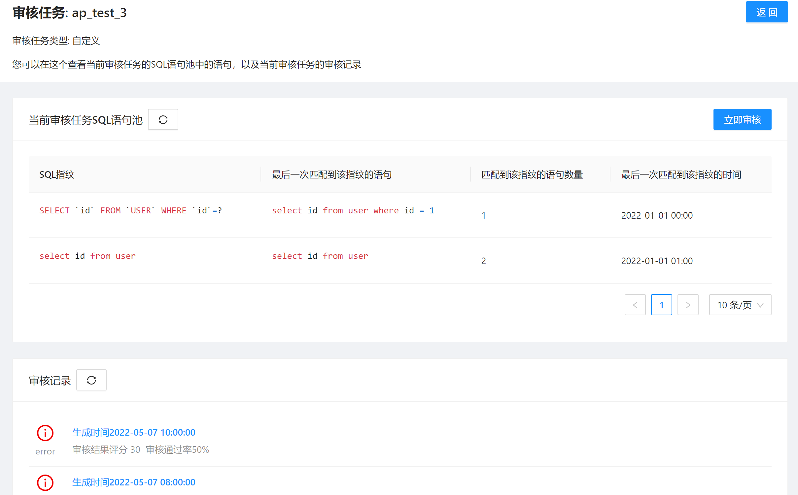

# 审核任务管理

## 创建审核任务

创建审核任务，进行一些配置，包括：静态或者动态分析（配置**数据源名称**为动态分析，反之为静态分析）、定时 Cron和数据库类型等。

创建审核任务后，审核任务列表展示如下：

列表页面展示了当前 SQLE 中正在运行的所有审核任务。点击审核任务的**编辑**按钮修改这个审核任务。另外可以看到**访问凭证**一列，这是给 Scanner 使用的，使用方式请参考[Scanner](./scanner.md)一章。

## 审核任务详情
点击**审核任务**，进入审核任务的详情页面：

在**审核任务**的详情页面，我们可以看到它的 SQL 池列表和对应产生的审核报告列表。

上图中展示的 SQL 池列表中的 SQL 是通过 [MyBatis Scanner](./scanner_management.md) 扫描代码仓库中文件得到的。**MyBatis Scanner** 会解析 XML 格式文件，将文件中解析出的 SQL 上传至相应的**审核任务**。