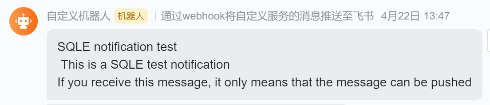
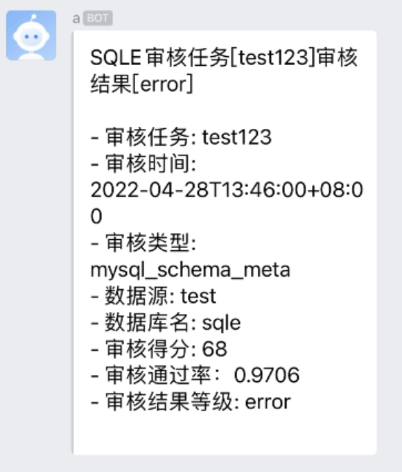

# 背景

审核任务审核出现不通过等情况时管理员应当可以尽快知道, 而不是等到管理员手动查看时才发现

# 通知设置方式

## 全局设置

| 设置项 | 设置项说明 |
| --- | --- |
| 推送间隔(分钟) | 时间间隔，在推送过一次之后的“间隔时间”之内即使审核出现了错误也不会进行推送。直到间隔时间过了之后触发了新的错误之后才会进行下一次推送。如果你想接收所有推送可以将该间隔设置为0 |
| 告警等级阈值 | 只有审核结果中包含高于或等于选择的告警等级的错误才会触发推送 |

## 测试通知功能

启用通知方式后点击 [发送测试消息] 按钮, 将会使用启用的通知方式(需要先提交保存设置)发送一条测试消息,效果如下

## 邮件通知

### 说明

邮件通知生效的前提是 [系统设置] 中的 [SMTP] 配置正确并启用且审核任务创建者绑定了正确的邮箱

### 配置项

| 设置项 | 设置项说明 |
| --- | --- |
| 启用邮件推送 | 启用此项后邮件推送才会生效, 启停邮件推送不会影响其他推送方式, 启用后如果触发会向审核任务创建者发送告警邮件 |

### 实际效果

## Webhook通知(企业版)

### 说明

Webhook通知为企业版功能, 此项可以将通知直接发到通讯软件(如飞书,企业微信)的群中, 而无需管理员人工转达审核失败的消息

### 配置项

| 设置项 | 设置项说明 |
| --- | --- |
| 启用Webhook推送 | 启用此项后Webhook推送才会生效, 启停Webhook推送不会影响其他推送方式, 启用后如果触发会向Webhook url发送根据模板生成的POST请求 |
| Webhook url | 告警消息发送目标, 此地址获取方式请查看对应通讯软件的对接文档 |
| Webhook模板(json) | 填写规则详解界面说明, 默认模板为飞书消息通知模板 |

### 实际效果

飞书通知效果

企业微信通知效果
