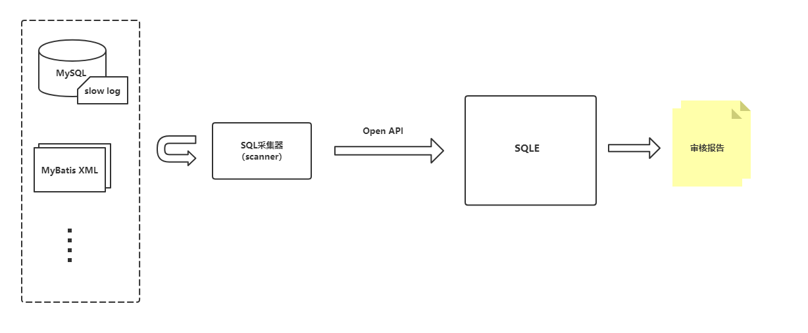

# Scanner 使用说明

## 一、简介

**Scanner** 是**审核任务管理**中负责解析并上传 SQL 的组件。 不同场景下的 **Scanner** 会有不同的解析行为，但它们最终都需要通过统一的 API 接口将 SQL 上传到 SQLE。由于 Scanner 是**
审核任务**功能对应的组件，所以在使用前需要创建审核任务，具体操作步骤见[审核任务管理](./auditplan_management.md)。


## 二、Scanner 存放位置

Scanner 打包在 SQLE RPM 中。在部署完 SQLE Server后（部署方式见[安装部署](../../2.deploy/overview.md)）, Scanner 的二进制放在 `${SQLE的工作目录}/bin`
目录下。如下：

```sh
[root@sqle-server bin]# pwd
/opt/sqle/bin
[root@sqle-server bin]# ll
total 62816
-rwxr-x--- 1 actiontech-universe actiontech 25064378 Sep 27 13:16 scannerd
-rwxr-x--- 1 actiontech-universe actiontech 39254854 Sep 27 13:16 sqled
```

## 三、Scanner 介绍

### 1. MyBatis Scanner

#### 概述

**MyBatis Scanner** 通过指定代码目录，扫描并解析目录中的 MyBatis XML 文件得到 SQL 语句。**MyBatis Scanner** 将解析出的 SQL 上传至 SQLE Server
后，触发审核并得到审核结果。如果审核结果中包含 Error 级别的错误（指触发了 Error 级别的[审核规则](../3.3_template/rule_template_management.md)），则将退出码（Exit
Code）置为非 0。

#### 参数说明

```sh
[root@sqle-server bin]# ./scannerd mybatis --help
Parse MyBatis XML file

Usage:
  SQLE mybatis [flags]

Flags:
  -D, --dir string         xml directory
  -h, --help               help for mybatis
  -S, --skip-error-query   skip the statement that the scanner failed to parse from within the xml file

Global Flags:
  -H, --host string    sqle host (default "127.0.0.1")
  -N, --name string    audit plan name
  -P, --port string    sqle port (default "10000")
  -A, --token string   sqle token
```

* host：SQLE Server 所在的主机 IP 地址（默认是当前主机）
* port：SQLE Server 提供 HTTP 服务的端口（默认是 10000）
* name：审核任务名（表示 Scanner 将 SQL 上传至哪个审核任务的 **SQL 池**）
* token：审核任务上传凭证（具体值可到审核任务列表页中**访问凭证**列中获取）
* dir: Mybatis XML 对应的文件夹
* skip-error-query: 如果scanner从xml中获取的SQL无法解析将会忽略这条SQL

#### 常见场景

通过集成到 CI/CD 进行开发阶段 SQL 审核， 通过持续的审核代码仓库中的 SQL 以及变更，可以提早发现问题。

### 2. SlowQuery Scanner（企业版功能）

#### 概述

**SlowQuery Scanner** 通过指定慢日志文件，扫描并解析文件中的慢 SQL 语句，并定时将解析出的 SQL 上传至 SQLe Server。在 SQLe Server 侧，通过审核任务中配置的 Cron
定时（或人工）触发审核。
**SlowQuery Scanner** 是一个常驻进程，它会持续的监控 Scanner 启动时指定的慢日志文件，一旦产生新的慢 SQL，它会增量解析并上传这些 SQL，可以将scanner启动为后台进程。

#### 参数说明

```sh
[root@sqle-server bin]# ./scannerd slowquery --help
Parse slow query

Usage:
  SQLE slowquery [flags]

Flags:
  -h, --help              help for slowquery
      --log-file string   log file absolute path

Global Flags:
  -H, --host string    sqle host (default "127.0.0.1")
  -N, --name string    audit plan name
  -P, --port string    sqle port (default "10000")
  -A, --token string   sqle token
```

* host：SQLE Server 所在的主机 IP 地址（默认是当前主机）
* port：SQLE Server 提供 HTTP 服务的端口（默认是 10000）
* name：审核任务名（表示 Scanner 将 SQL 上传至哪个审核任务的 **SQL 池**）
* token：审核任务上传凭证（具体值可到审核任务列表页中**访问凭证**列中获取）
* log-file：慢日志文件的绝对路径
