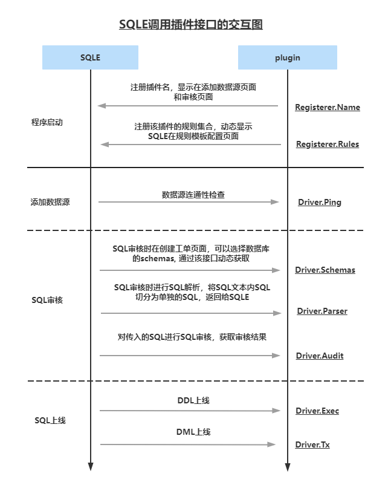

# 数据库审核插件开发

在本篇文档中，会介绍如何开发一个数据库审核插件，分为**快速开始部分**和**详细部分**。如果你是一个对 Go 语言不太了解的人，可以先通过**快速开始部分**的文档，实现一个简单的数据库审核插件。当你对插件开发有了一定的了解之后，可以通过**详细部分**的文档，通过更多自定义的方式，实现更加复杂的数据库审核插件。

## 快速开始部分

### 一、前置

#### 1. 语法
由于 SQLE 是一个用 Go 语言开发的开源项目，如果你对 Go 语言完全不了解，需要先了解 Go 语言的基础语法，建议使用官方的 Go 语言快速开始文档（[Go Tour](https://tour.golang.org/welcome/1) 或者 [Go 语言之旅](https://tour.go-zh.org/welcome/1)），如果你已经了解了 Go 语言的基础语法，可以直接跳过本部分。

#### 2. 包管理
SQLE 插件是一个独立于 SQLE 的进程，所以编写插件的方式与开发一个新的 Go 语言项目并没有什么差异。Go 语言项目使用 Go Modules 来管理包，所以在开始之前你需要先了解一下 Go Modules 的使用方法。建议参考[这篇文档](https://golang.org/doc/tutorial/getting-started)，文档中大致介绍了如果开始一个新的 Go 语言项目，并通过 Go Modules 的方式来调用其他项目的包，如果你已经了解了 Go Modules 的使用方法，可以直接跳过本部分。

#### 3. Go 语言项目构建

### 二、编写插件

这一小节会假设你已经创建了一个由 Go Modules 管理的审核插件项目。下面开始介绍插件核心代码的开发。

#### 1. 插件库介绍

SQLE 为了方便插件的开发，在自身的插件层之上做了一层封装（Adaptor），插件开发者可以使用这个封装库来快速的开发一个数据库审核插件。

在开发之前，你需要先引入 SQLE：

```bash
go get github.com/actiontech/sqle@v1.2111.0-pre1 # 此版本为该文档编辑时的最新版本
```

选择 SQLE 中两个库插件相关的库：
1. github.com/actiontech/sqle/sqle/driver
2. github.com/actiontech/sqle/sqle/pkg/driver

第一个库定义了插件规则的结构体，在你编写插件规则时需要用到这个库。

第二个库中实现了一些默认的插件，在引入这个库后，只需要实现相应的规则与规则处理函数即可。其中三个默认的插件为：
1. PostgreSQL
2. Oracle
3. SQL Server

如果这三个默认的插件不能满足需求，可以自己实现一个插件，参考本篇文档「**自定义插件**」小节。

#### 2. 选择插件

下面假设你想要实现一个 SQL Server 的审核插件。在 main 函数中创建一个空的 SQL Server 审核插件，这时你的 main 文件应该是这样的：
```Go
package main

import (
	"github.com/actiontech/sqle/sqle/driver"
	adaptor "github.com/actiontech/sqle/sqle/pkg/driver"
)

func main() {
	plugin := adaptor.NewAdaptor(&adaptor.MssqlDialector{})
}
```

#### 3. 编写插件规则与规则处理函数
假设你需要实现一个规则，该规则检查 SQL 是否使用了 select *。

定义规则如下：

```Go
Rule{
	Name:     "aviod_select_all_column", # 规则ID，该值会与插件类型一起作为这条规则在 SQLE 的唯一标识
	Desc:     "避免查询所有的列", # 规则描述
	Category: "DQL规范", # 规则分类，用于分组，相同类型的规则会在 SQLE 的页面上展示在一起
	Level:    driver.RuleLevelError, # 规则等级，表示该规则的严重程度。在插件注册阶段，会使用所有 RuleLevelError 级别的规则创建一个默认的规则模板。
}
```

规则的处理函数如下：

```Go
func(ctx context.Context, rule *driver.Rule, sql string) (string, error) {
	if strings.Contains(sql, "select *") {
		return rule.Desc, nil
	}
	return "", nil
}
```
这里为了演示，这个处理函数只是简单的使用了字符串匹配的方式，你也可以使用正则或者 AST 语法树的方式来检查 SQL 语句（AST 的方式会在「**自定义 SQL 解析器**」一小节中介绍）。

最后将插件规则与规则处理函数通过 `plugin.AddRule()` 函数注册到 SQLE 中，注册完成后，你的 main 文件应该是这样的：
```Go
package main

import (
	"github.com/actiontech/sqle/sqle/driver"
	adaptor "github.com/actiontech/sqle/sqle/pkg/driver"
)

func main() {
	plugin := adaptor.NewAdaptor(&adaptor.MssqlDialector{})
	aviodSelectAllColumn := &driver.Rule{
		Name:     "aviod_select_all_column",
		Desc:     "避免查询所有的列",
		Category: "DQL规范",
		Level:    driver.RuleLevelError,
	}
	aviodSelectAllColumnHandler := func(ctx context.Context, rule *driver.Rule, sql string) (string, error) {
		if strings.Contains(sql, "select *") {
			return rule.Desc, nil
		}
		return "", nil
	}
	plugin.AddRule(aviodSelectAllColumn, aviodSelectAllColumnHandler)

	////////////////////////////////////////////
	// ... 编写更多规则并通过 AddRule 注册到 SQLE 中
	////////////////////////////////////////////

	// 最后关键一步，调用 `plugin.Serve()` 启动插件：
	plugin.Serve() 
}
```

#### 4. 构建并使用插件

和通常的程序编写流程一样，编写完插件代码后，需要将其构建成二进制文件，然后才能将其注册到 SQLE 中。执行 `go build -o ${二进制名} main.go` 将插件代码构建成二进制文件。最后参考[数据库审核插件使用](./auditplugin_management.md) 来使用你的自定义插件。

### 二、 自定义部分

#### 1. 自定义 SQL 解析器
前面介绍的审核规则都是通过字符串匹配的方式来解析 SQL 的内容。这种方式适合规则较少且 SQL 简单的情况下使用。

如果需要对 SQL 进行更复杂的解析匹配，恰好你选择的数据库插件又有相应的 SQL 解析器，这时可以使用自定义 SQL 解析器的方式来编写插件。

首先通过调用 `WithSQLParser()` 注册自己的 SQL 解析器。在添加规则时则使用 `plugin.AddRuleWithSQLParser()` 添加带有解析器的处理函数。在处理函数中，将 interface{} 断言成具体的 AST 语法树，通过语法树级别的操作来更加精细的处理 SQL。PostgreSQL 提供了基于 cgo 调用的解析器（见：[PostgreSQL SQL 解析器](github.com/pganalyze/pg_query_go/v2)），下面的代码展示了如何写一个 SQL 解析器的插件：

```Go
func main() {
	plugin := adaptor.NewAdaptor(&adaptor.PostgresDialector{})

	// 依然是定义规则
	aviodSelectAllColumn := &driver.Rule{
		Name:     "aviod_select_all_column",
		Desc:     "避免查询所有的列",
		Category: "DQL规范",
		Level:    driver.RuleLevelError,
	}

	// 依然是定义处理函数，这时处理函数的参数是 interface{} 类型，需要将其断言成 AST 语法树。
	aviodSelectAllColumnHandler := func(ctx context.Context, rule *driver.Rule, ast interface{}) (string, error) {
		node, ok := ast.(*parser.RawStmt)
		if !ok {
			return "", errors.New("ast is not *parser.RawStmt")
		}

		switch stmt := node.GetStmt().GetNode().(type) {
		case *parser.Node_SelectStmt:
			for _, target := range stmt.SelectStmt.GetTargetList() {
				column, ok := target.GetResTarget().GetVal().GetNode().(*parser.Node_ColumnRef)
				if !ok {
					continue
				}
				for _, filed := range column.ColumnRef.GetFields() {
					_, ok = filed.GetNode().(*parser.Node_AStar)
					if ok {
						return rule.Desc, nil
					}
				}
			}
		}
		return "", nil
	}

	// 依然是注册规则，与前面的例子不同的是，这时使用的是 `plugin.AddRuleWithSQLParser()` 。
	plugin.AddRuleWithSQLParser(aviodSelectAllColumn, aviodSelectAllColumnHandler)

	// 依然是启动插件，与前面的例子不同的是，需要将 SQL 解析的方法注册到插件中。
	plugin.Serve(adaptor.WithSQLParser(func(sql string) (ast interface{}, err error) {
		// parser.Parse 使用 PostgreSQL 的解析器，将 sql 解析成 AST 语法树。
		result, err := parser.Parse(sql)
		if err != nil {
			return nil, errors.Wrap(err, "parse sql error")
		}
		if len(result.Stmts) != 1 {
			return nil, fmt.Errorf("unexpected statement count: %d", len(result.Stmts))
		}

		// 将 SQL 的语法树返回。
		return result.Stmts[0], nil
	}))
}
```

#### 2. 自定义插件
如果 driver 包中默认的 PostgreSQL、Oracle 与 SQL Server 插件不能满足你的需求的话，你也可以自定义一个数据库插件。方法就是实现一个接口：
```Go
type Dialector interface {
	Dialect(dsn *driver.DSN) (driverName string, dsnDetail string)
	ShowDatabaseSQL() string
	String() string
}
```

在实现这个接口前，你需要先了解一下 Go 语言原生 Driver 的概念（以 [MySQL Driver](https://github.com/go-sql-driver/mysql) 为例）。

下面介绍 Dialector 接口的含义：
1. `Dialect`：实现该方法，通过 DSN 提供的 Host Port User Password Database 信息和你选择的数据库 driver，构造出 driverName 与 dsnDetail。driverName 是你引入的数据库 driver 名称；dsnDetail 是连接数据库驱动的必要信息。这两个参数最终会通过 `sql.Open()` 来创建一个数据库连接。
2. `ShowDatabaseSQL`：实现该方法，可以自定义你数据源中默认展示的数据库列表，该数据库列表最终会展示在工单审核列表的数据库下拉框中，如下图：

3. `String`：实现该方法，该方法的返回值会作为你实现的数据库审核插件名展示在 SQLE 的相关下拉框中，如下图：


将你的实现作为 NewAdaptor 的参数传入即可，后续的步骤与前面规则相关的介绍一致。

## 二、详细部分

### 1. SQLE与插件的交互图

### 2. 插件接口说明
#### 2.1 注册接口说明
该接口定义了该插件的名称和实现的规则，SQLE启动的时候会调用该接口获取插件名称和该插件支持的规则列表。
```go
type Registerer interface {
	Name() string
	Rules() []*model.Rule
}
```
1. `Name`: 插件名，最终会展示在 SQLE 页面的数据源类型的下拉框中；
2. `Rules`: 插件支持的规则，在启动 SQLE 时，会调用插件获取这些规则，你将在规则模板内看到它们。

#### 2.2 审核接口说明
该接口定义了SQLE进行审核时，由插件完成的和具体数据库底层交互的操作
```go
type Driver interface {
	Close(ctx context.Context)
	Ping(ctx context.Context) error
	Exec(ctx context.Context, query string) (driver.Result, error)
	Tx(ctx context.Context, queries ...string) ([]driver.Result, error)
	Schemas(ctx context.Context) ([]string, error)
	Parse(ctx context.Context, sqlText string) ([]Node, error)
	Audit(ctx context.Context, sql string) (*AuditResult, error)
	GenRollbackSQL(ctx context.Context, sql string) (string, string, error)
}
```
1. `Close`: 关闭审核插件使用的相关资源，通常是完成一次审核后，关闭数据库连接等资源;
2. `Ping`: 检测数据库的连接性,通常在添加数据源时，为了检测填写的数据是否正确，会调用此方法;
3. `Exec`: 执行 SQL 上线时执行此方法；
4. `Tx`: 执行 SQL 上线时执行此方法，一般当SQL是DML时且需要事务执行时会批量执行SQL；
5. `Schemas`: 返回审核插件展示给用户的 Schema 列表；
6. `Parse`: 解析审核插件支持的 SQL 格式；
7. `Audit`: 根据指定的SQL语句生成审核建议；
8. `GenRollbackSQL`: 生成 SQL 的回滚语句。

#### 2.3 插件的配置信息说明
```go
type Config struct {
	DSN           *DSN
	Rules          []*Rule
}
```
1. `DSN`: 数据源信息, 待审核的数据库；
2. `Rules`: 本次审核制定的规则列表。

#### 2.4 初始化函数说明
插件的主进程入口，由插件的 main 函数调用即可实现插件
```go
func ServePlugin(r Registerer, newDriver func(cfg *Config) Driver)
```
1. `r`: 传入 Registerer 的接口实现, 由插件侧实现； 
2. `newDriver`: 传入 Driver 的初始化函数，该函数的入参是 `Config` 是由 SQLE 向插件传递的配置信息，函数的出参是 Driver 的接口实现，由插件侧实现。

