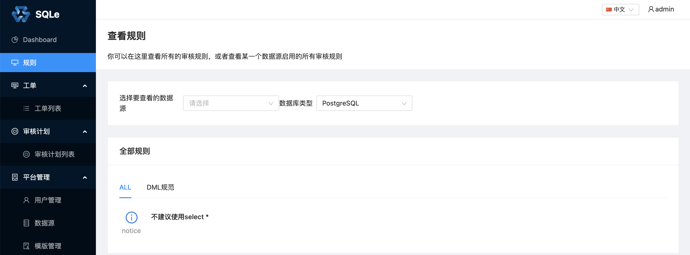

# 审核插件管理

## 配置插件
创建插件二进制目录，通常创建在 SQLE 的工作目录下：
```
bash-4.2$ ls -l
total 24
drwxr-x--- 2 actiontech-universe actiontech 4096 Oct  8 09:30 bin
drwxrwx--- 1 actiontech-universe actiontech 4096 Oct 12 13:40 etc
drwxr-x--- 1 actiontech-universe actiontech 4096 Oct 12 13:40 logs
drwxr-xr-x 1 actiontech-universe actiontech 4096 Oct  8 09:30 plugins # 创建插件目录
drwxr-x--- 2 actiontech-universe actiontech 4096 Oct  8 09:30 scripts
drwxr-x--- 3 actiontech-universe actiontech 4096 Oct  8 09:30 ui
```

修改配置文件 sqle.yml：
```
server:
  sqle_config:
    server_port: 10000
    auto_migrate_table: true
    debug_log: false
    log_path: './logs'
    plugin_path: './plugins'   # 此处填写插件目录，也可以填写绝对路径
  db_config:
    mysql_cnf:
      mysql_host: '127.0.0.1'
      mysql_port: '3306'
      mysql_user: 'root'
      mysql_password: 'mysqlpass'
      mysql_schema: 'sqle'
```

## 重启 SQLE Server
重启 SQLE Server 以加载审核插件。成功加载插件后，日志中会打印当前加载的审核插件：

```
time="2021-10-12T14:06:42+08:00" level=info msg="starting sqled server"
time="2021-10-12T14:06:42+08:00" level=info msg="plugin inited" plugin_name=PostgreSQL
...
time="2021-10-12T14:06:43+08:00" level=info msg="starting http server on :10000"
```

查看 SQLE 规则页面，PostgreSQL 插件支持的审核规则已经加载到 SQLE Server：


添加数据源，显示已经可以添加 PostgreSQL 类型的数据源。
