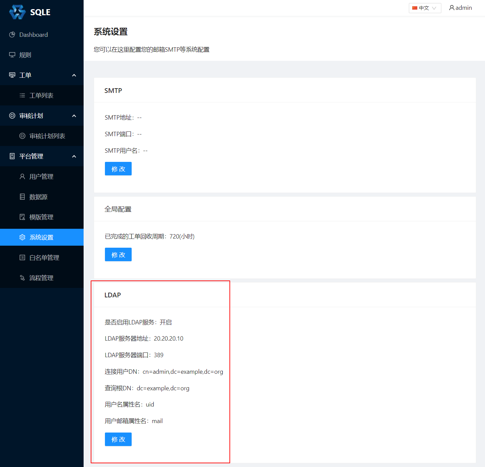
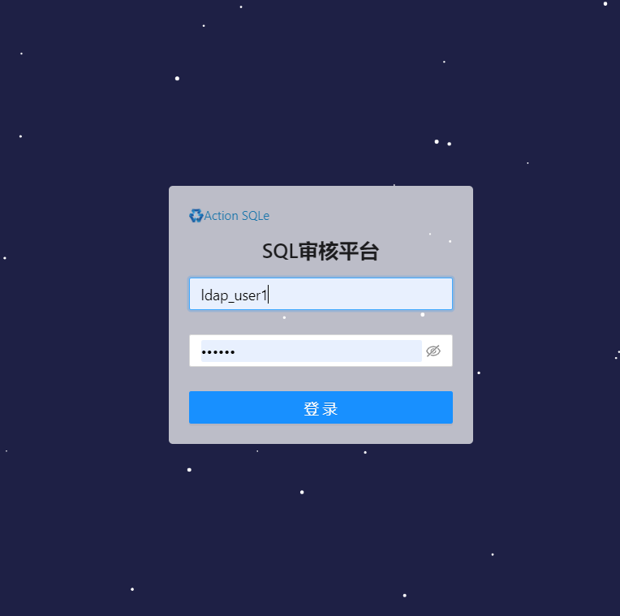

# LDAP设置

## 背景

### LDAP 简介

企业内部需要认证的服务很多，员工需要记住很多的密码，
即使对这些服务进行相同的密码设置，也存在很大的安全隐患。每一个新员工的到来管理员都要初始化很多密码，而这些密码都被设置成了“888888”等弱密码，由于各种软件的认证机制之间没有使用一个统一的标准，员工无法一次性修改所有服务的密码，这导致很多即使是入职很久的员工都还在使用这个“众所周知”的密码。

另外—个比较严重的问题出现在公司增加内部服务的时候，例如领导要在公司内部提供邮件服务或把现有的Proftpd 换成更高效的Vsftpd，管理员需要重新为所有的员工初始化新的账户信息，对于一个有上千员工的企业来说这将是一个“灾难”。

如果可以为各种软件提供一个标准的认证机制，所有软件就可以不再用独有的用户管理方法，
而是通过这种统一的认证机制进行用户认证，这样就解决了目前很多企业遇到的问题。LDAP正是这样一种标准的协议，LDAP的历史可以追溯到1988年，之后诞生的很多软件基本上都支持这个协议。近年随着企业对LDAP需求的不断增加，绝大多数有认证机制的软件都会首先提供对LDAP的支持。本文将介绍通过LDAP统一身份认证的方法，以简化这种复杂的管理过程。

LDAP的内部数据结构为树状结构, 所有的用户和部门都作为这棵树的一个节点, 部门名称,用户名,密码,邮箱等会作为节点的一个属性存在

### SQLE 中的LDAP登录功能

SQLE中支持通过配置的方式接入LDAP系统, 如同其他系统一样接受统一的用户管理, 以便于管理员管理SQLE中的用户, 也使得员工无需在使用一套公司内通用账号密码的同时单独记录SQLE的账号密码

在SQLE中, 如果正确配置并启用了LDAP功能, 用户就可以在登录界面使用LDAP中记录的账号密码进行登录, SQLE会在员工第一次登录时同步此员工的账号和邮箱, 并在以后的登录中均通过LDAP校验此账户

## LDAP配置修改方式

LDAP的配置展示在如图的位置, 点击对应 **[修改]** 按钮可以进行配置修改, 点击按钮后效果如下图

可根据需要修改对应条目, 修改后点击 **[提交]** 保存配置, 也可点击 **[取消]** 取消本次修改

修改后ldap用户即可通过sqle登录界面进行登录

## LDAP配置各参数释义

1. 是否启用LDAP服务
    - 填写说明: 此选项为开关
    - 作用: 只有当此选项被打开时LDAP功能才会生效. 此选项关闭时仅保存LDAP相关配置, 不会使用此功能

2. LDAP服务器地址
    - 填写说明: 填写LDAP服务器的IP地址(不含端口号)
    - 作用: 用于LDAP登陆时SQLE找到LDAP服务器的位置

3. LDAP服务器端口
    - 填写说明: 填写LDAP服务器上LDAP服务的监听端口
    - 作用: 用于LDAP登陆时SQLE找到LDAP服务的工作端口

4. 连接用户DN:
    - 填写说明: 填写管理用户的 DN(Distinguished Name) ,类似于 'cn=admin,dc=example,dc=org' , 不是管理用户的用户名, 且管理用户需要有查询其他可能登录用户的权限
    - 作用: 当用户登录时需要先使用管理用户登录到LDAP中查找出登录用户在LDAP中的DN, 再使用查找出的DN和登录用户填写的密码进行LDAP登录校验

5. 连接用户密码:
    - 填写说明: 此项不会进行展示, 如果不希望修改之前设置的密码可以不填这一项, 点击保存后会继续使用原密码而不会使用空值覆盖原密码
    - 作用: 连接用户DN登录时的密码

6. 查询根DN
    - 填写说明: 查询时只会查找以此DN为根节点的树, 如两个部门在LDAP中对应的节点互相不在对方的子树上, 此时如果查询根DN设置成其中一个部门的DN, 则另一个部门将无法通过LDAP登录SQLE
    - 作用: 用于限定SQLE中LDAP登录的作用范围

7. 用户属性名
    - 填写说明: 填写用户名在LDAP中对应的节点属性名, 一般设置为uid
    - 作用: 用于LDAP用户登录时查询登录用户的DN, LDAP中此属性对应的值也将用作此用户第一次登录SQLE自动注册时的用户名
   
8. 用户邮箱属性名
   - 填写说明: 填写用户邮箱在LDAP中对应的节点属性名, 一般设置为mail
   - 作用: SQLE将根据此属性名从LDAP中获取到用户的邮箱, 并将此邮箱用于此用户第一次登录SQLE自动注册时的用户邮箱