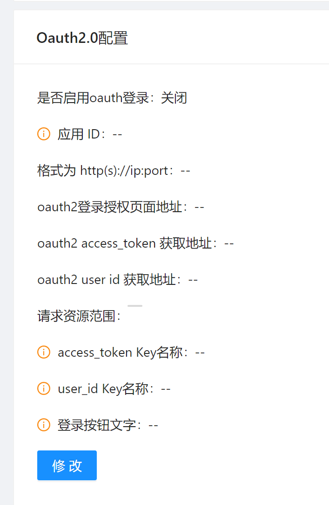

# OAUTH2设置

## 背景

### OAUTH2 简介

OAuth 2.0是一个业界标准的授权协议（authorization protocol），这里的授权是以委派代理（delegation）的方式。可以这样理解，OAuth
2.0提供一种协议交互框架，让某个应用能够以安全地方式获取到用户的委派书，这个委派书在OAuth 2.0中就是访问令牌（access token），随后应用便可以使用该委派书，代表用户来访问用户的相关资源。

### SQLE 中的OAUTH2登录功能

SQLE中支持通过配置的方式接入OAUTH2系统, 如同其他系统一样接受统一的用户管理, 以便于管理员管理SQLE中的用户, 也使得员工无需在使用一套公司内通用账号密码的同时单独记录SQLE的账号密码

在SQLE中, 如果正确配置并启用了OAUTH2功能, 用户就可以在登录界面使用第三方登录, SQLE会在员工第一次登录时要求用户绑定或自动创建一个SQLE用户, 并在以后的登录中可以使用OAUTH2用户登录,
也可以用绑定的SQLE用户账号密码登录

## OAUTH2 配置修改方式

LDAP的配置位于 [系统设置] 模块中, 点击对应 **[修改]** 按钮可以进行配置修改

可根据需要修改对应条目, 修改后点击 **[提交]** 保存配置, 也可点击 **[取消]** 取消本次修改

启用后SQLE登录界面出现第三方登录入口

### 配置项说明

| 字段名 | 字段说明 |
| --- | --- |
| 是否启用oauth2 |开启后才会启用oauth2登录 |
| 应用ID |  应用的唯一标识, 从要对接的平台申请 , 在OAuth2.0认证过程中，appid的值即为oauth_consumer_key的值。 |
| 应用密钥 |  appid对应的密钥，访问用户资源时用来验证应用的合法性。在OAuth2.0认证过程中，appkey的值即为oauth_consumer_secret的值。 |
| 外部访问sqle的地址 | 格式为 http(s)://ip:port |
| oauth2登录授权页面地址 | 格式类似于 http(s)://ip:port/xxx |
| oauth2 access_token 获取地址 | 格式类似于 http(s)://ip:port/xxx |
| oauth2 user id 获取地址 |  格式类似于 http(s)://ip:port/xxx |
| 请求资源范围 |  此范围由验证服务器定义 |
| access_token放置位置 | sqle会在获取用户ID时将access_token放在这个key对应的value中, 此参数会作为get请求的参数发送给用户ID获取地址 |
| 用户ID保存位置 | sqle会尝试使用此key从第三方平台的响应中解析出用户ID,用户ID应当为唯一ID |
| 登录按钮文字 | oauth2登录按钮文字 |