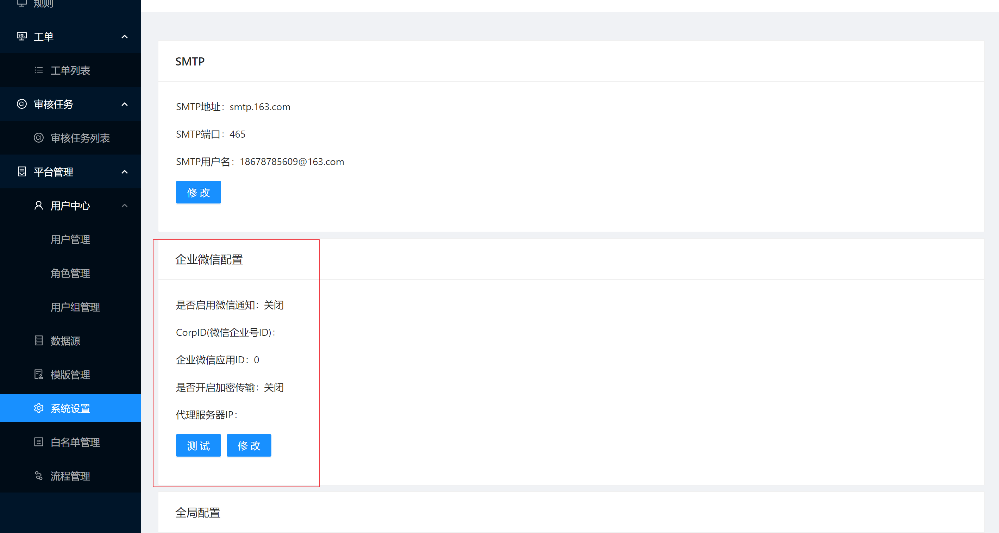
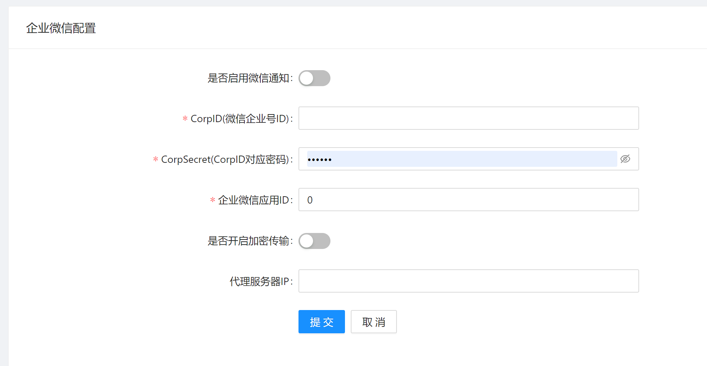
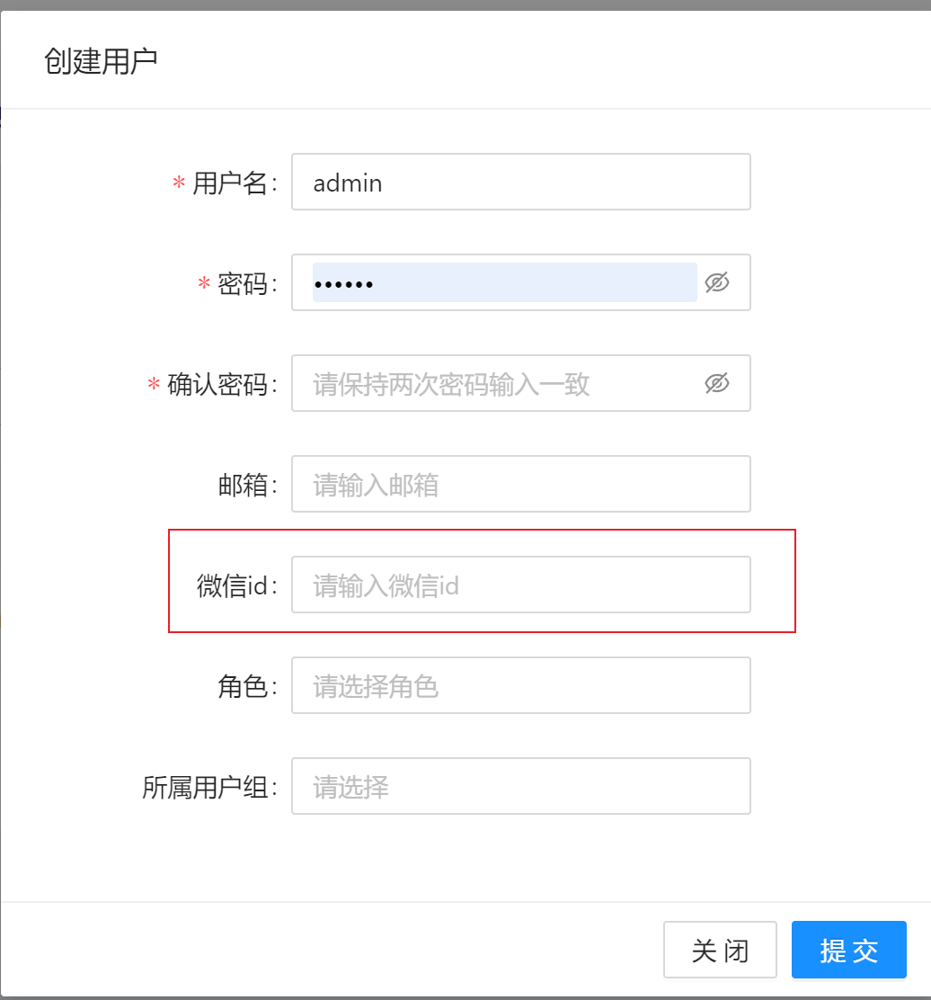

# 企业微信设置(企业版功能)

## 背景

SQLE在企业版中提供了企业微信通知的方式, 用于补充SQLE消息通知方式, 便于相关人员在不方便接收邮件时可以及时看到SQLE的通知

## 使用说明

### 功能位置

[平台管理] - [系统设置] - [企业微信配置]

### 参数解释

| 设置项 | 中文解释 | 参数类型 | 备注 |
| --- | --- | --- | --- |
| 是否启用微信微信通知 | 启用后将会开启微信通知 | bool ||
| CorpID(微信企业号ID) | 见官方文档 corpid | string| [官方文档](https://developer.work.weixin.qq.com/document/10013) |
| CorpSecret(CorpID对应密码) | 见官方文档 secret | string | [官方文档](https://developer.work.weixin.qq.com/document/10013) |
| 企业微信应用ID | 见官方文档 agentid | int | [官方文档](https://developer.work.weixin.qq.com/document/10013) |
| 是否开启加密传输 | 关闭的效果类似于聊天, 打开效果类似于通知, 需要点进去看详情| bool ||
| 代理服务器IP| 企业微信代理服务器IP| string ||

### 使用方式

1. 配置好相关配置并打开企业微信通知功能
2. 点击测试, 输入测试用[企业微信用户ID](https://open.work.weixin.qq.com/help2/pc/15956?person_id=1), 点击测试
3. 查看企业微信, 收到对应消息
4. 为SQLE用户绑定[企业微信用户ID](https://open.work.weixin.qq.com/help2/pc/15956?person_id=1), 各处修改用户信息的地方均可以修改企业微信ID
   
5. 当触发通知后对应用户绑定的企业微信用户将收到对应通知

### 触发通知

1. 触发条件同邮箱通知
2. 启用或关闭企业微信通知不会影响到其他通知方式