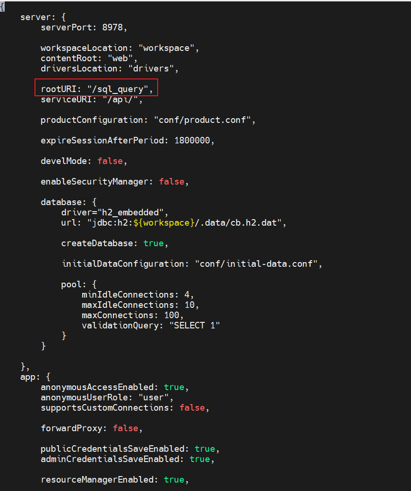
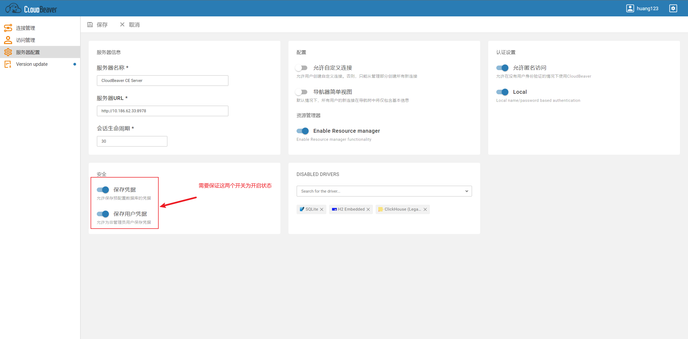
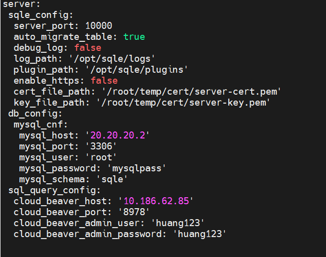
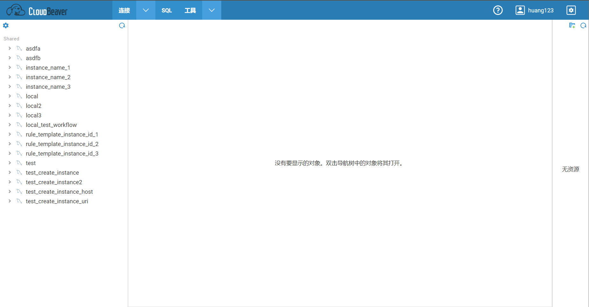
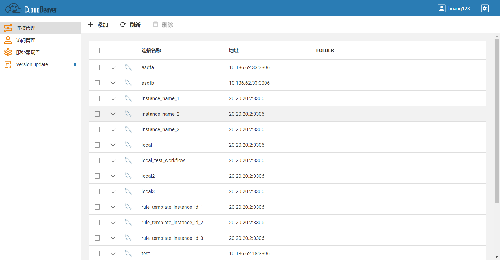
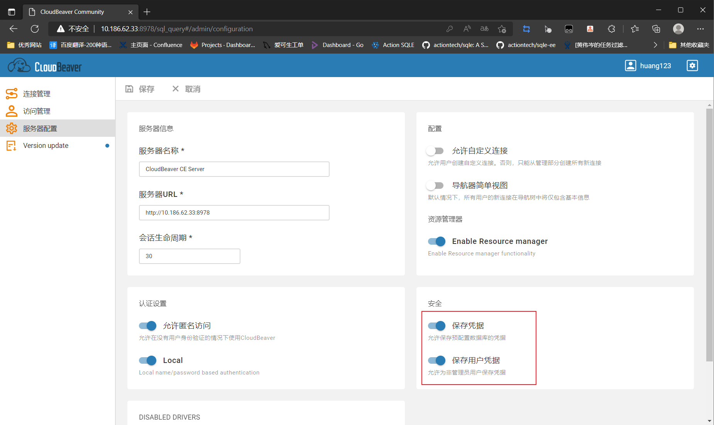
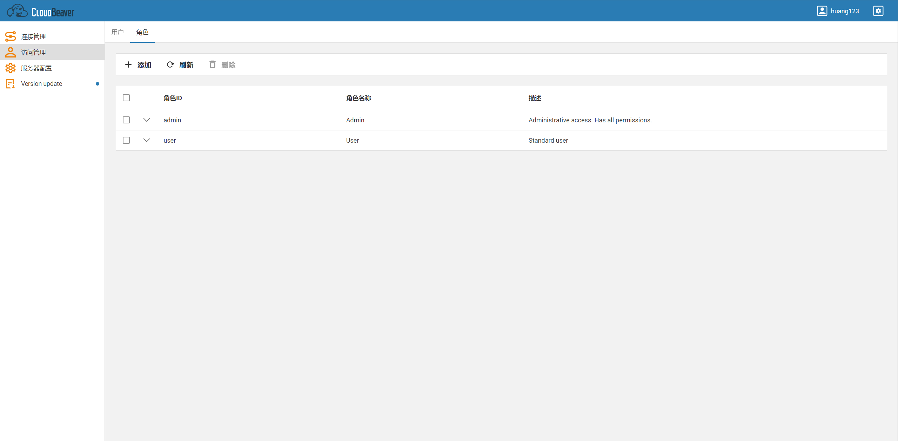
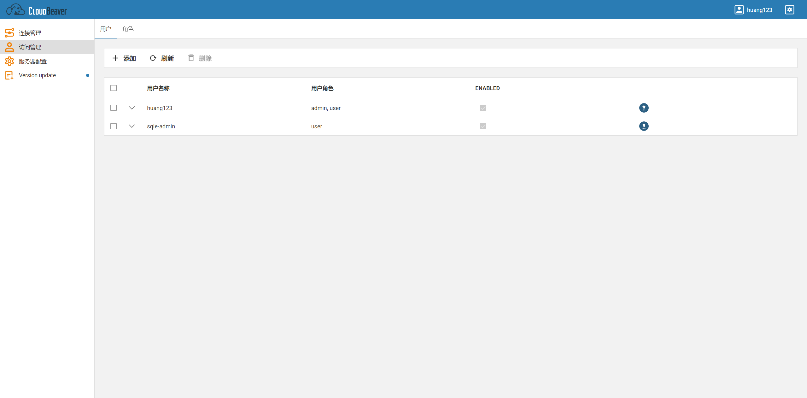
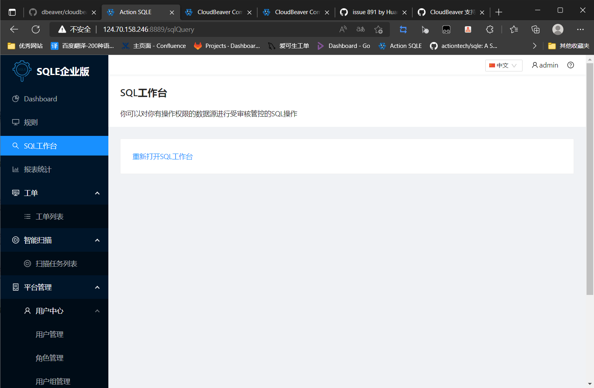

# 配置SQL工作台

## 1. 安装CloudBeaver(已安装CloudBeaver的可以跳过这一步)

注意事项: 当前只支持 22.2.0 版本的CloudBeaver, 使用其他版本可能会导致兼容性问题

docker 部署：https://github.com/dbeaver/cloudbeaver/wiki/Run-Docker-Container

源码安装：https://github.com/dbeaver/cloudbeaver/wiki/Build-and-deploy

## 2. CloudBeaver配置流程

### 2.1. 修改CloudBeaver配置文件

#### 2.1.1配置文件修改内容

| 配置文件名 | 是否必须修改 | 修改内容 | 修改原因 |
| --- | --- | --- | --- |
| cloudbeaver.conf | 是 | 1. 将server.rootURI的值改为'/sql_query' 2. server.serviceURI 的值改为 '/api/'(server.serviceURI默认就是/api/) | SQLE目前只支持代理这个路由 |

#### 2.1.2修改完毕后的文件效果

cloudbeaver.conf

### 2.2. 重启CloudBeaver

### 2.3. 使用管理员登录CloudBeaver(此时CloudBeaver地址应当为 http://{IP}:8978/sql_query#/)

### 2.4. 确认CloudBeaver配置

## 3. SQLE配置流程

### 3.1. 修改SQLE配置文件, 增加SQL工作台参数(参数见下方说明)

#### 3.1.1 参数说明

配置文件新增参数

| 参数字段 | 参数说明 |
| --- | --- |
| sql_query_config | sql工作台参数, 此参数与 sqle_config在同一级 |

sql_query_config 子参数

| 参数字段 | 参数说明 |
| --- | --- |
| cloud_beaver_host | cloudbeaver IP地址 |
| cloud_beaver_port | cloudbeaver访问端口 |
| cloud_beaver_admin_user | cloudbeaver管理员账户 |
| cloud_beaver_admin_password | cloudbeaver管理员密码 |

配置完毕后文件内容大致如图

### 3.2. 重启SQLE

### 3.3. 注意事项

1. 配置文件一般位于SQLE工作目录的etc目录下, 文件名一般为sqled.yml
2. sql_query_config 与 sqle_config在同一级, 其余参数在 sql_query_config 的下一级, 需要注意缩进
3. 管理员账户需要有 [添加/修改/删除] [用户/实例/权限] 的权限
4. SQLE集成CloudBeaver后请勿在使用管理员账户直接操作CloudBeaver的 用户/实例/权限

## 4. 配置完成检查

### 4.1. 确认CloudBeaver配置正确

#### 4.1.1. 确认关键配置文件正确

使用 http://{IP}:8978/sql_query#/ 可以进入CloudBeaver即代表配置正确

#### 4.1.2. 使用管理员账户登录CloudBeaver原地址

#### 4.1.3. 进入管理界面

#### 4.1.4. 检查服务器配置, 确认安全选项均已打开

#### 4.1.5. 确认角色正确

[访问管理] - [角色] 处应当只有admin和user两个角色

#### 4.1.6. 确认没有冲突用户

[访问管理] - [用户] 处不应当有名称格式为 sqle-xxx的用户存在, 这会与SQLE自动创建的用户冲突

### 4.2. 检查SQLE是否已成功集成CloudBeaver

点击SQL工作台, 应当可以正常跳转到CloudBeaver, 且原SQLE网页应当如图所示

