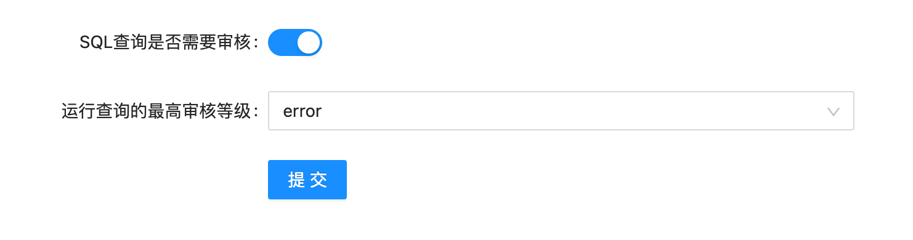
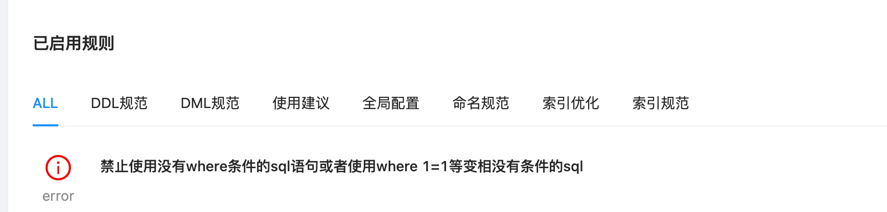
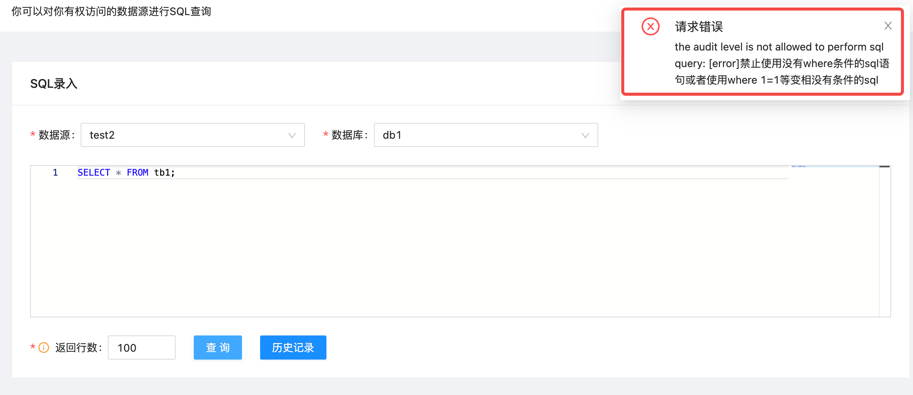
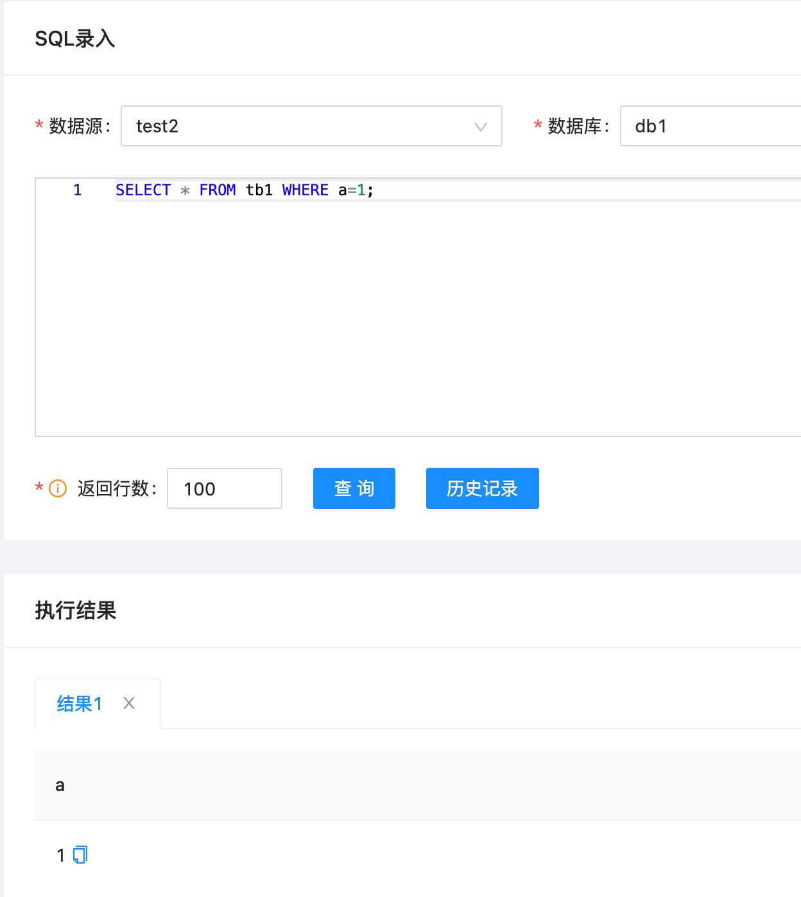

# SQL审核

SQL查询的审核功能根据数据源绑定的审核规则对要执行的SQL审核，不满足条件的SQL将不能被执行。

## 数据源配置

点击左侧导航栏的「角色管理」进入数据源管理页面，编辑绑定的数据源。这里有2项与SQL查询审核相关的配置。打开审核功能，点击"提交"

|参数名        |含义                             |默认值                  |
| ----------- | ------------------------------ | --------------------  |
|SQL查询是否需要审核|SQL查询前是否需要对SQL语句进行审核|默认不审核|
|运行查询的最高审核等级 |可填的等级按从低到高为：normal、notice、warn、error，如果SQL查询审核结果的等级高于或等于这里填的等级，则该SQL语句不能被执行。如：这里填的等级为warn，则只有审核结果等级为nomal、notice的SQL才能执行|当开启审核功能时，默认等级为error|

## SQL审核
    
本例中，在数据源绑定的审核模板中启用了这样一条审核规则（审核模板的使用详见[规则模板管理](../3.3_template/rule_template_management.md)）：

点击左侧导航栏的「SQL查询」进入查询页面，进行SQL查询，如下图：

这条SQL违反了一条等级error的审核规则，不能被执行，页面右上角会有相关的报错提示。

修改SQL，让它符合审核规则后，就能正常执行查询。如图：

