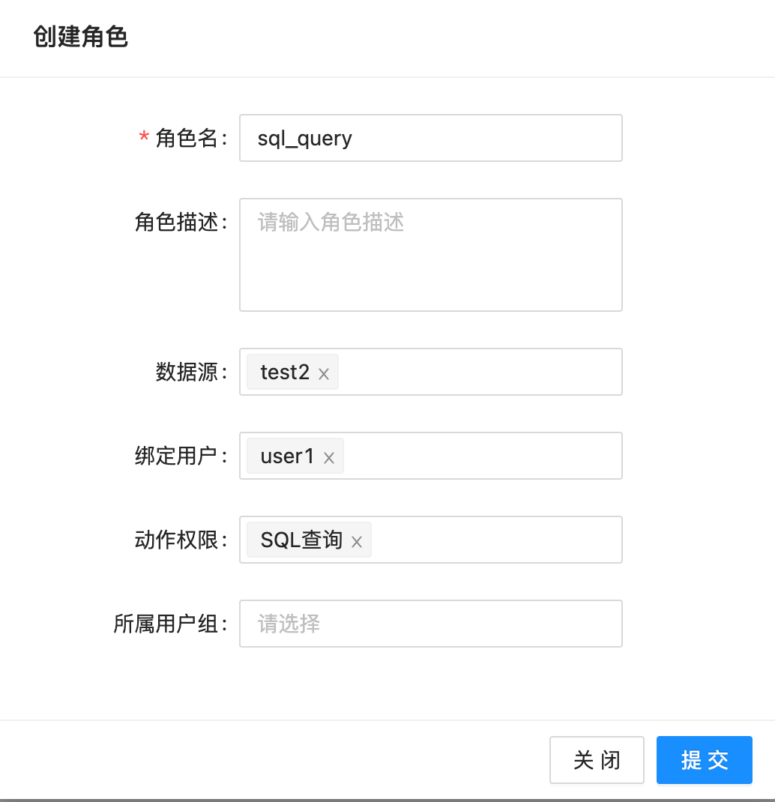
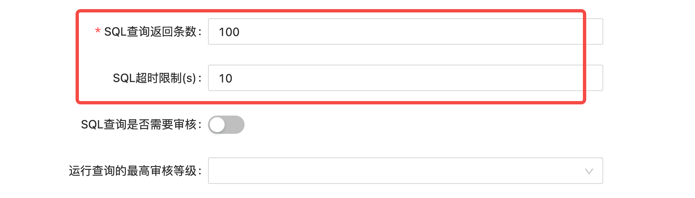
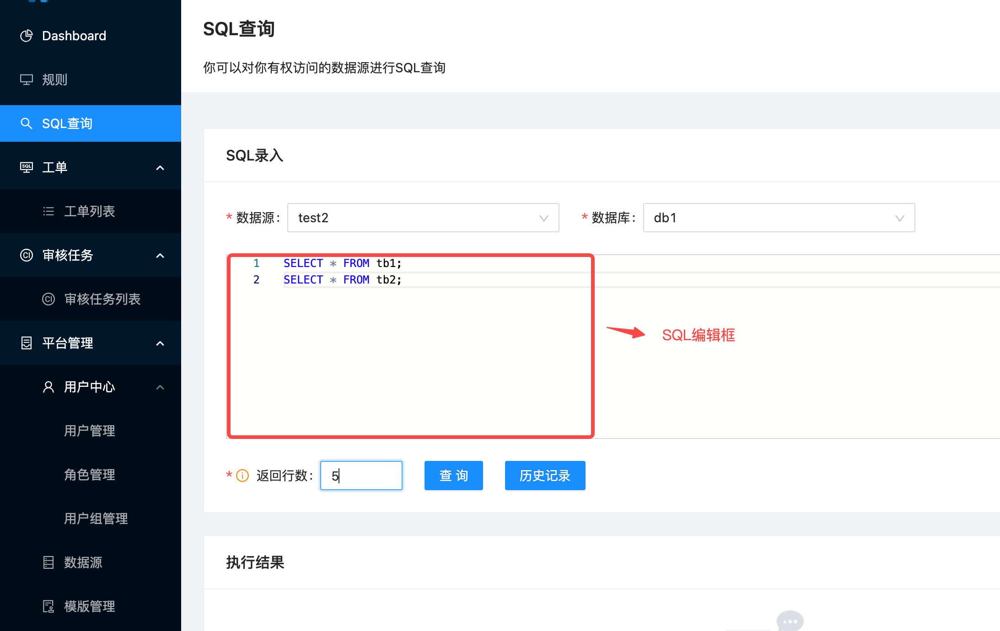
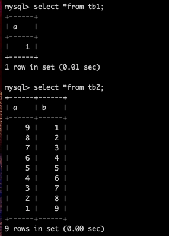
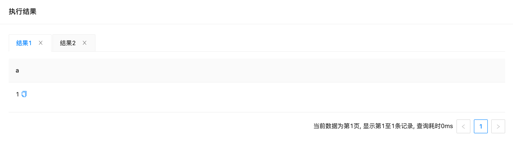
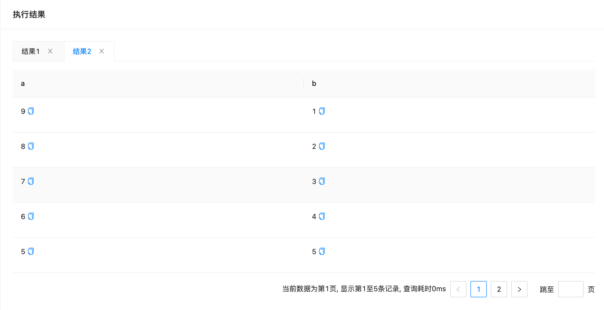
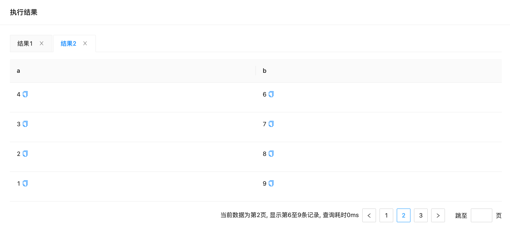

# SQL查询

SQLE v1.2205.0企业版新增了SQL查询的功能，本篇文章将介绍基本的查询方法。                           

## SQL查询权限

点击左侧导航栏的「角色管理」进入角色管理页面，点击「创建角色」，在「动作权限」下拉框中，新增了"SQL查询"，这里创建一个拥有"SQL查询"权限的角色并绑定用户user1、数据源test2，如下图：

## 数据源配置

点击左侧导航栏的「角色管理」进入数据源管理页面，编辑刚刚绑定的数据源test2。这里有4项与SQL查询相关的配置，本篇文章介绍前两项，后两项在[SQL审核](../4.0_sqlquery/sqlquery_audit.md)中介绍。

|参数名        |含义                             |默认值                  |
| ----------- | ------------------------------ | --------------------  |
|SQL查询返回条数|执行SQL查询时，结果展示的单页最大条目数|当配置为0时，会设置默认值100|
|SQL超时限制   |执行SQL查询的超时时间，若执行SQL超过超时时间，就会报错。单位：秒|当配置为0时，会设置默认值10|

## 查询页面

点击左侧导航栏的「SQL查询」进入查询页面，如下图：

      
页面说明：
* 数据源：要执行查询语句的数据源
* 数据库：数据源中要执行查询语句的数据库
* SQL编辑框：要执行的查询语句，可填多条
* 返回行数：结果展示的单页最大条目数。这里的条目数和数据源中配置的"SQL查询返回条数"相关联，实际返回最大条目数取二者中小的那一个。如本例中，结果返回的单页最大条目数是5。

### 查询结果
在MySQL实例test2中，db1.tb1和db1.tb2的数据如下：

点击"查询"，每条SQL的返回结果会单独作为一个tab页展示，本例中执行了两条SQL语句，返回结果展示为两个tab。tab页中第一行为column名称，以下为各行数据。  
第一条SQL的查询结果：

第二条SQL的查询结果（点击右下角的翻页按钮可以查看后续页）：  
第一页

第二页

