# SQL工作台使用

## 1. 配置实例权限

### 1.1. 创建一个有SQL查询权限的角色

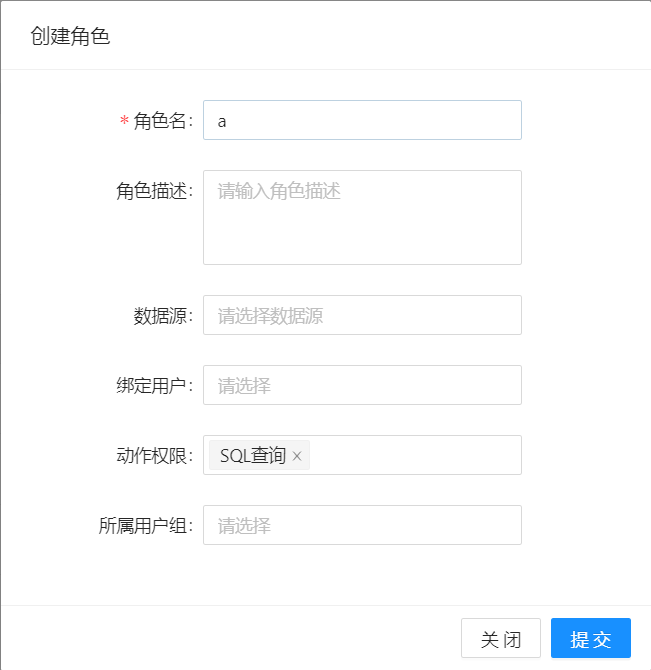

### 1.2. 绑定角色和实例

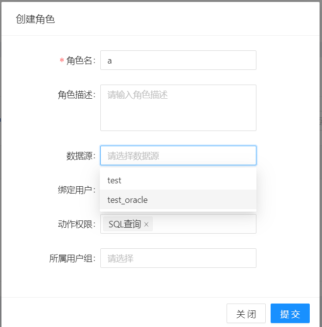

### 1.3. 创建一个用户,并绑定到刚才的角色

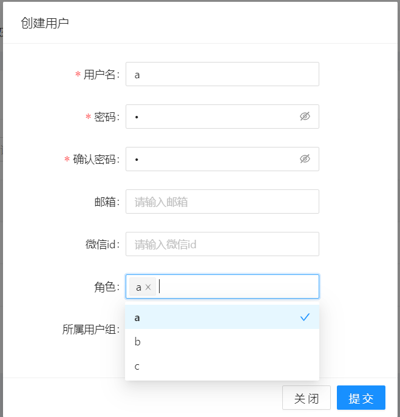

## 2. 配置实例审核等级

### 2.1. 创建/修改一个实例, 填写基础参数

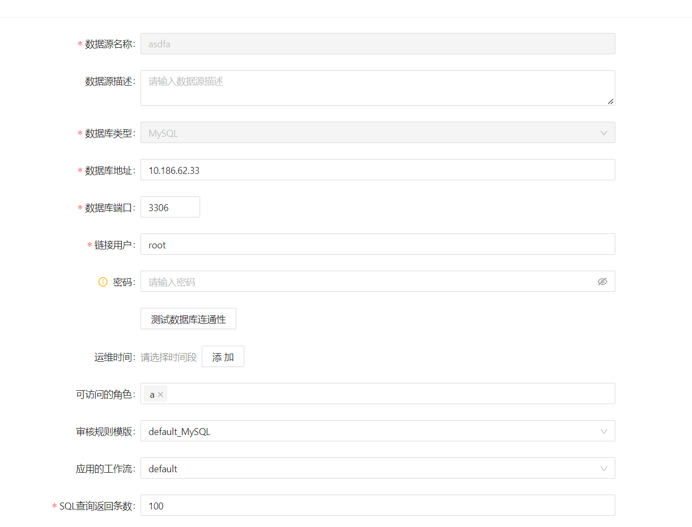

### 2.2. 填写实例参数最下方SQL查询相关配置, 并提交修改

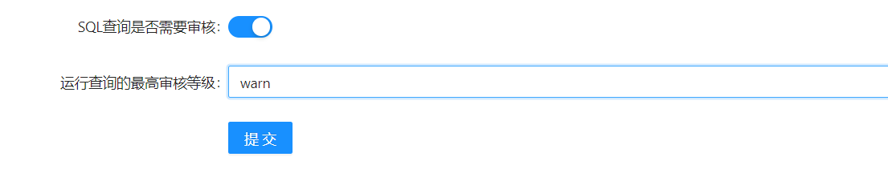

#### 2.2.1参数说明

| 参数名 | 参数含义 |
| --- | --- |
| SQL查询是否需要审核 | 只要此项开启的实例才会在执行SQL时进行审核 |
| 运行查询的最高审核等级 | 如果审核等级低于这个等级将会放行, 高于这个等级将无法执行 |

## 3.使用SQL工作台

### 3.1登录CloudBeaver

### 3.2自动登录说明

在登陆SQLE时会检测CloudBeaver是否处于登陆状态, 如果CloudBeaver当前没有登录, SQLE将会自动使用当前SQLE用户登录CloudBeaver, 用户也可以自行使用SQLE用户从CloudBeaver中登录
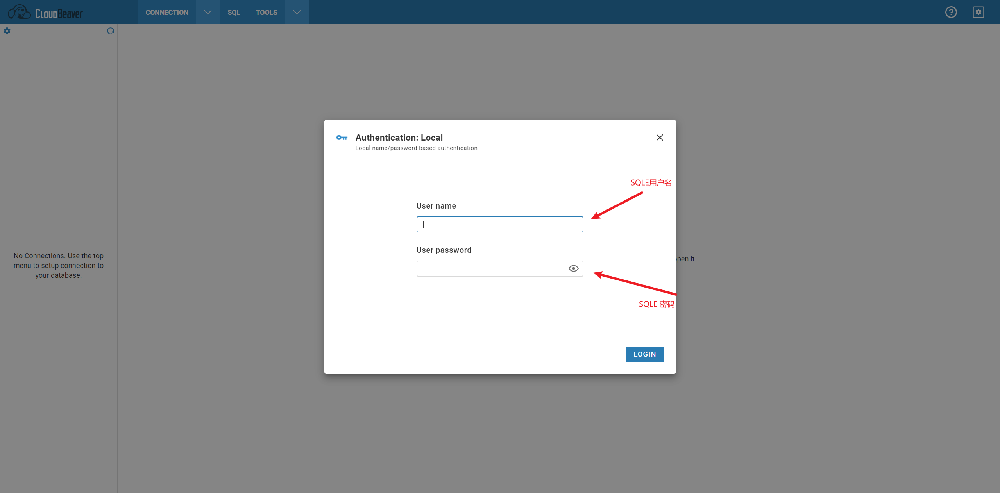

### 3.3用户/实例同步说明

1. 实例与用户均在用户登录时进行同步
2. 因CloudBeaver产品限制, 用户/实例/权限的改动不会对已登录用户生效, 期望看到最新的改动需要重新登陆CloudBeaver
3. admin用户可以看到所有SQLE实例
4. 不支持的实例类型将不会进行同步
5. SQLE将会屏蔽管理用户, 即使用CloudBeaver管理员将无法从SQLE的CloudBeaver处登录

### 4.下发SQL

#### 4.1.创建一个链接

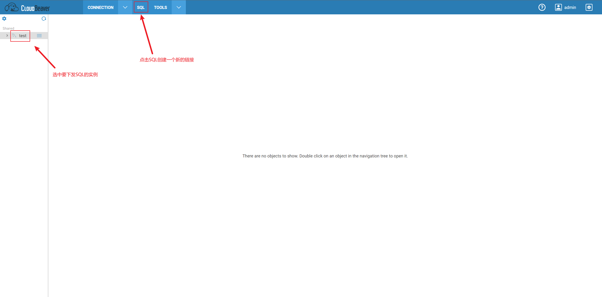

#### 4.2. 输入需要执行的SQL

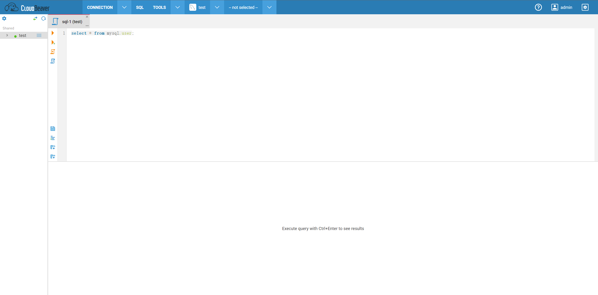

#### 4.3. 点击执行按钮

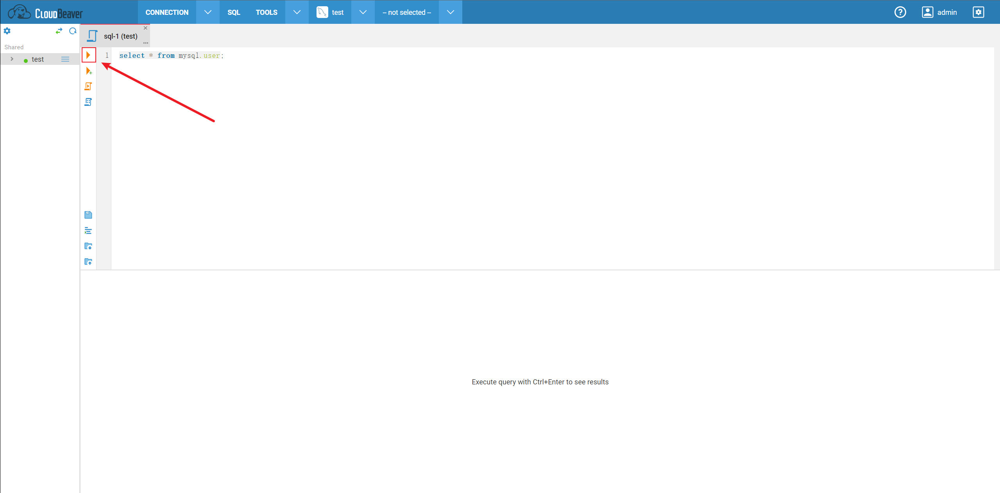

#### 4.4. 审核失败的SQL将会被拦截, 并报出错误, 可以点击Details查看审核详情

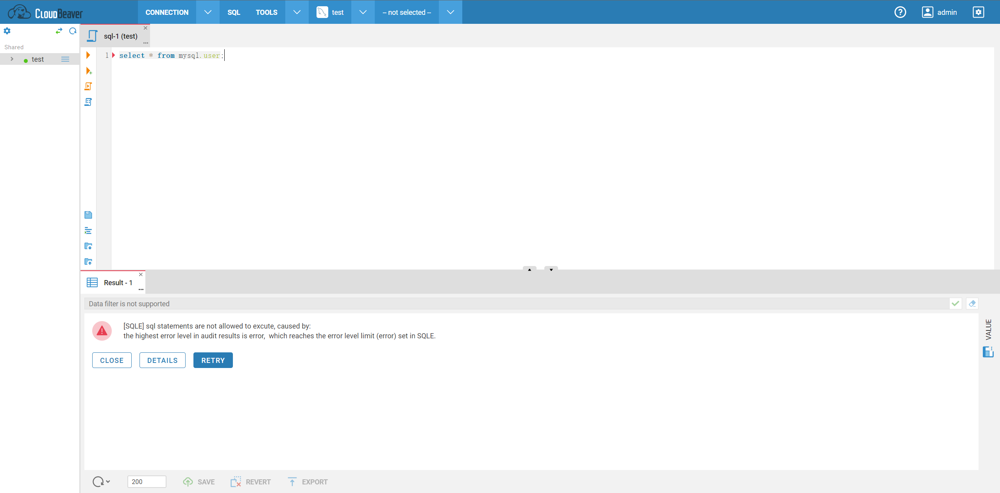
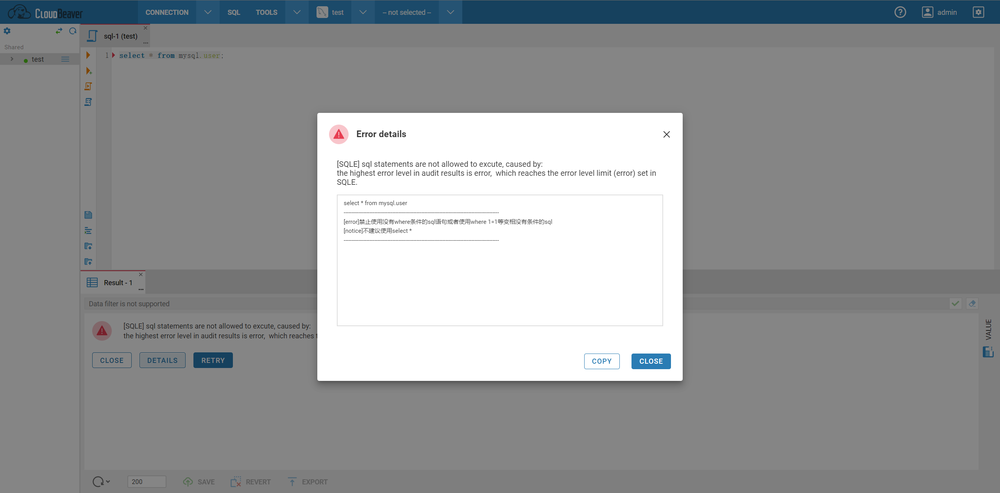

#### 4.5. 按要求修改SQL, 再次执行, 如果审核通过将会执行当前SQL

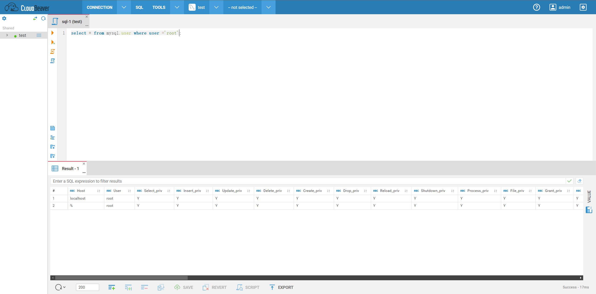
