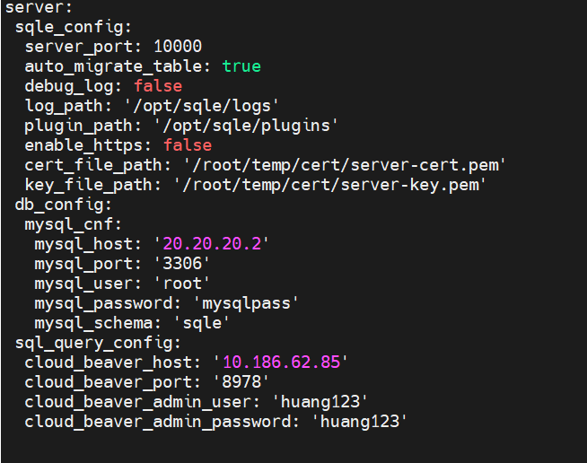

# 配置SQL工作台

## 整体配置流程

#### 1. 配置CloudBeaver

#### 2. 配置SQLE

## CloudBeaver配置流程

1. 修改CloudBeaver配置文件
2. 重启CloudBeaver
3. 使用管理员登录CloudBeaver(此时CloudBeaver地址应当为 http://{IP}:8978/sql_query#/)

4. 确认CloudBeaver配置

### 配置文件修改内容

| 配置文件名 | 是否必须修改 | 修改内容 | 修改原因 |
| --- | --- | --- | --- |
| cloudbeaver.conf | 是 | 1. 将server.rootURI的值改为'/sql_query' 2. server.serviceURI 的值改为 '/api/'(server.serviceURI默认就是/api/) | SQLE目前只支持代理这个路由 |
| product.conf | 否 | 将core.user.defaultTheme的值改为'dark' | 暗色主题与SQLE更搭 |

#### 修改完毕后的文件效果

cloudbeaver.conf

product.conf

#### 确认服务器配置

## SQLE配置流程

1. 修改SQLE配置文件, 增加SQL工作台参数(参数见下方说明)
2. 重启SQLE

### 参数说明

配置文件新增参数

| 参数字段 | 参数说明 |
| --- | --- |
| sql_query_config | sql工作台参数, 此参数与 sqle_config在同一级 |

sql_query_config 子参数

| 参数字段 | 参数说明 |
| --- | --- |
| cloud_beaver_host | cloudbeaver IP地址 |
| cloud_beaver_port | cloudbeaver访问端口 |
| cloud_beaver_admin_user | cloudbeaver管理员账户 |
| cloud_beaver_admin_password | cloudbeaver管理员密码 |

配置完毕后文件内容大致如图

### 注意事项

1. 配置文件一般位于SQLE工作目录的etc目录下, 文件名一般为sqled.yml
2. sql_query_config 与 sqle_config在同一级, 其余参数在 sql_query_config 的下一级, 需要注意缩进
3. 管理员账户需要有 [添加/修改/删除] [用户/实例/权限] 的权限
4. SQLE集成CloudBeaver后请勿在使用管理员账户直接操作CloudBeaver的 用户/实例/权限
