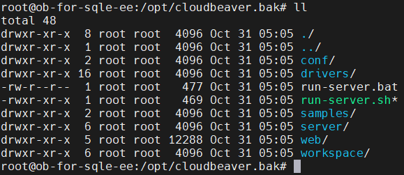

# 使用SQLE定制CloudBeaver包快速搭建环境

## 定制包简介

### 简介

SQLE在原有CloudBeaver `release_22_2_0` 分支的基础上, 增加了对OceanBase 和 TiDB 的支持, 方便使用 SQLE 管理 OceanBase 和 TiDB 的用户更方便的使用SQL工作台功能.
同时, SQLE 调整了CloudBeaver的部分默认配置, 用户在使用SQLE定制包时将无需在手动配置环境, 方便用户更好的集成两者

### 效果展示

***新增两种数据库类型的支持***

### 定制分支与原分支区别详情

1. 支持并默认启用 OceanBase 驱动

2. 支持并默认启用 TiDB 驱动

3. 默认访问路由调整为 /sql_query, 便于与SQLE集成

4. 默认会话超时时间调整为12小时(之前是30分钟)

5. 移除了默认创建的 PG 演示实例和 SQLite 演示实例

6. docker镜像名调整为 actiontech/sqle-cloudbeaver:22_2_0

7. 优化打包方式, 大幅提高打包效率

8. 默认主题改为暗色

## 项目地址

定制CloudBeaver分支: https://github.com/actiontech/cloudbeaver/tree/sqle_22_2_0

定制DBeaver分支: https://github.com/actiontech/dbeaver/tree/sqle_22_2_0

## 定制包下载地址

https://github.com/actiontech/cloudbeaver/releases/tag/sqle.22.2.0

## 使用说明

### 编译和运行项目

与 [原项目编译运行方式](https://github.co/dbeaver/cloudbeaver/wiki/Build-and-deploy) 保持一致

### 编译docker镜像

进入项目的 `deploy/docker` 目录, 然后执行 `./make-docker-container.sh`

### 运行docker镜像

方式一: 进入项目的 `deploy/docker` 目录, 然后执行 `./run-docker-container.sh`

方式二: 手动启动镜像, 镜像参数和 [原项目镜像参数](https://github.com/dbeaver/cloudbeaver/wiki/Run-Docker-Container) 保持一致

### 已有CloudBeaver环境升级为定制环境

CloudBeaver程序目录下应当有以下几个文件

将CloudBeaver程序目录下的`conf`目录和`workspace`目录移动到定制CloudBeaver程序目录下(覆盖原目录), 随后停止旧CloudBeaver, 运行新CloudBeaver即可