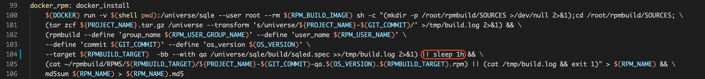

## 一、诊断手法
### 1. 查看systemd日志
如果是 centos7 下 systemctl 启动，通过 `journalctl` 查看启动日志
```bash
journalctl -u sqled|grep -v systemd # 如果未筛选出内容可执行 journalctl -u sqled 查看全部内容
```
## 二、常见问题
### 1. `sqled.yml` 配置文件权限不足
#### 诊断
检查 SQLE 安装路径下 `sqle/etc/sqled.yml` 对于用户`actiontech-universe` 是否有可读权限。
#### 修复
```bash
chown actiontech-universe:actiontech sqled.yml
```

### 2. 程序启动后打开页面白屏
#### 原因1：未使用 systemd 启动程序
使用命令行直接启动 SQLE， 需要在 SQLE 主目录下启动，不然找不到前端文件，**建议使用systemd**，如果必须使用命令行，可以参考：
```bash
cd /opt/sqle # 假设安装在/opt目录下
./bin/sqled --config /opt/sqle/etc/sqled.yml --pidfile=/opt/sqle/sqled.pid
```
#### 原因2：缺少前端文件
确认 sqle/ui 目录是否存在或是否有内容。如果损坏，建议重新安装。

### 3. 执行 make docker_rpm 报错

SQLE 的 RPM 打包使用的是 Docker 打包方式。当执行 `make docker_rpm` 报错时，大多数情况需要到 Docker 打包容器里查看报错日志。具体步骤如下：
1. 在 docker_rpm target 中添加一个 sleep，如下图：

2. 进入 Docker 打包容器
3. cat /tmp/build.log 查看报错信息