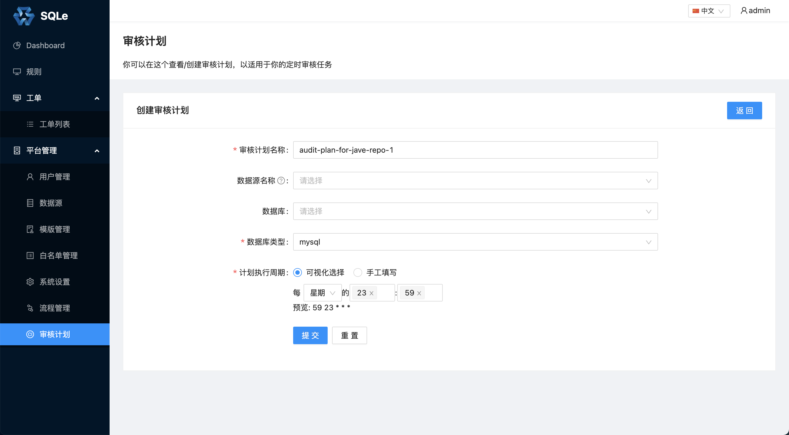

# 审核计划

## 概述
**审核计划**是 SQLE 中的一个基于 Cron 的 SQL 自动审核系统。下面介绍 SQLE 中引入**审核计划**功能的背景。

## 场景
在[审核工单管理](TODO)中我们介绍了如何通过 SQLE 进行 SQL 审核并上线的流程。在这流程中，通常是审核一些 DDL，如建库（create database）、建表（create table）和改表（alter table）等语句。
审核工单管理，主要解决 SQL 上线的规范化流程化的问题，它能够帮助 DBA 自动化处理整个 SQL 上线过程中一些重复繁琐的工作。

**审核工单管理**也有它的局限性。

* 第一，通常**审核工单管理** 中流转的是 DDL 一类的 SQL，它们的上线通常是一次性操作。DDL 上线后，通常还会有业务 SQL（通常是 DML）访问数据库。这时可能会遇到一些执行效率较低的业务 SQL 造成数据库的性能问题。这类 SQL 是**审核工单管理**无法覆盖到的。
* 第二，通常在使用**审核工单管理**审核需要上线的 SQL 时，项目已经临近发版，功能都已经实现完毕。如果这时审核出 SQL 存在一些问题，是否修复这些问题，可能会收到很多因素的影响（如 SQL 问题的影响面大小，项目发版的紧急程度等）。虽然这类 SQL **审核工单管理**可以覆盖到，但因为外部因素，也会导致问题 SQL 的存在。

SQLE 引入**审核计划**来解决上面的两个问题。下面介绍审核计划的使用。

## 使用

一个**审核计划**的成功运行需要两方参与，分别是 SQLE 和 **Scanner**（关于 Scanner 的详细介绍点击[这里](TODO)）。Scanner 上传 SQL 到 SQLE，SQLE 根据配置触发审核。

### 创建审核计划

创建审核计划，进行一些配置，包括：静态或者动态分析（配置**数据源名称**为动态分析，反之为静态分析）、定时 Cron和数据库类型等。

创建审核计划后，审核计划列表展示如下：

列表页面展示了当前 SQLE 中正在运行的所有审核计划。点击审核计划的**编辑**按钮修改这个审核计划。另外可以看到**访问凭证**一列，这是给 Scanner 使用的，使用方式请参考 [Scanner](./scanner.md)一章。

